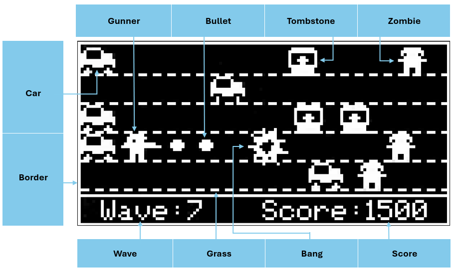

# Zomwar - Game built on AK Embedded Base Kit

<center>
</center>

<hr>

## Gameplay Demo

<!-- <div align="center">
    <video src="https://github.com/ak-embedded-software/archery-game/assets/54855481/d493703c-bf5b-4fd2-ae04-b86784a01231" alt="epcb archery game" height=200/>
</div> -->

## Documentation

| File | Description |
|---|---|
| [README.md](README.md) | Main project overview, hardware information, gameplay rules, and object descriptions. |
| [docs/runtime-signal-processing.md](docs/runtime-signal-processing.md) | Runtime signal-processing flow for button input, AK task messages, timers, game-loop ticks, object updates, and Mermaid sequence diagrams. |
| [docs/eeprom-data-storage.md](docs/eeprom-data-storage.md) | EEPROM storage layout for game settings and scores, including magic-number validation, checksum protection, read/write flow, and related APIs. |
| [docs/game-object-sequences.md](docs/game-object-sequences.md) | Runtime sequence diagrams for gameplay objects: Archery, Arrow, Meteoroid, Bang, and Border. |
| [docs/display-design.md](docs/display-design.md) | Display design notes for screen layout, bitmap assets, rendering flow, and screen transitions. |
| [docs/buzzer-audio.md](docs/buzzer-audio.md) | Buzzer and audio behavior notes for sound effects, silent mode, playback timing, and related APIs. |

## Introduction

Zomwar is an action survival game built directly on the AK Embedded Base Kit platform — a hands-on learning resource for embedded programming enthusiasts to explore Event-driven Programming in depth. Through building and running Zomwar, learners apply core concepts of modern embedded engineering:
- System design: Using UML to model complex logic flows.
- Process management: Coordinating and executing Tasks efficiently.
- Communication: How Signal, Timer, and Message handle real-time responses.
- Control logic: Building robust state machines for the character, Zombies, and match progression.

### I. Hardware

<table align="center">
  <tr>
    <td align="center"></td>
  </tr>
</table>
<p align="center"><strong><em>Figure 1:</em></strong> AK Embedded Base Kit - STM32L151</p>

[AK Embedded Base Kit](https://epcb.vn/products/ak-embedded-base-kit-lap-trinh-nhung-vi-dieu-khien-mcu) is an evaluation kit for advanced embedded software learners.

The KIT integrates **1.54" Oled LCD**, **3 push buttons**, and **1 Buzzers** that play music, to learn **the event-driven system** through hands-on game machine design.
The KIT also integrates **RS485**, **Qwiic Connect System**, and **Grove Ecosystems**, suitable for prototyping practical applications in embedded systems.

**MCU Overview:**

```text
SoC Name : STM32L151CBT6
RAM      : 16 KB

Flash Partitions Layout
----------------------
[ 0x08000000 - 0x08001FFF ] : Bootloader Partition (8 KB)
=> AK Bootloader

[ 0x08002000 - 0x08002FFF ] : BSF Shared Partition (4 KB)
=> Used for data sharing between Bootloader and Application

[ 0x08003000 - 0x0801FFFF ] : Application Partition (116 KB)
=> Zomwar firmware
```

**MCU Naming Convention:**

| Part | Meaning |
|---|---|
| `STM32` | STMicroelectronics 32-bit MCU family. |
| `L` | Low-power series. |
| `151` | STM32L151 product line. |
| `C` | 48-pin package. |
| `B` | 128 KB Flash memory. |
| `T` | LQFP package. |
| `6` | Industrial temperature grade. |


<table align="center">
  <tr>
    <td align="center"></td>
  </tr>
</table>
<p align="center"><strong><em>Figure 2:</em></strong> Board view Top + Bottom </p>

### II. Game Description and Objects
"The following document outlines the gameplay and core mechanics of “Zomwar.” It will serve as a reference guide for future game design and development."

<table align="center">
  <tr>
    <td align="center"></td>
  </tr>
</table>
<p align="center"><strong><em>Figure 3:</em></strong> Menu game</p>

The game starts with the **Menu game** screen with the following options:
- **Play:** Begin playing the game.
- **Setting:** Configure the game's parameters.
- **Rank:** View the top 3 highest scores achieved.
- **Exit:** Exit the game menu to the idle screen.

<table align="center">
  <tr>
    <td align="center"></td>
  </tr>
</table>
 <p align="center"><strong><em>Figure 4:</em></strong> Game play screen and objects</p>

#### Objects in the Game:
|Object Name|Description|
|---|---|
|**Gunner**|Moves up and down to choose the firing position|
|**Bullet**|Fired from the gunner, used to destroy zombies|
|**Zombie**|An object that moves toward the gunner at an increasing speed, capable of destroying the border|
|**Car**|An object located in front of the border, serving as the second checkpoint after the gunner; it is activated to move and destroy zombies when a zombie touches it|
|**Bang**|An effect that appears when a zombie is destroyed|
|**Tombstone**|Object flying towards the bow with increasing speed, capable of destroying the border|
|**Border**|The safe zone that must be protected from zombie intrusion|

> **Note:** For detailed object runtime sequences, see [Game Object Sequences](docs/game-object-sequences.md).

### III. How to Play:
- In this game, you control the Gunner, moving up/down with the two buttons [Up]/[Down] to choose the position to fire the Bullet. In addition, to make the Gunner move faster, you can press and hold the [Up] button to go up or [Down] to go down.
- When you press the [Mode] button, the Bullet is fired in order to destroy the approaching Zombies.
- The goal of the game is to score as many points as possible; the game ends when a Zombie touches the Border.

#### Game Mechanics:
- **Scoring:** The score is counted by the number of Zombies destroyed. Each Zombie destroyed corresponds to 10 points. The accumulated score is displayed in the bottom-right corner of the screen. In addition, you can observe the number of Zombies destroyed in the bottom-left corner of the screen.
- **Difficulty:** At certain time intervals, waves of Zombies attack. Each time you survive a Zombie wave, the Zombies' movement speed increases by one level. The Zombies' initial movement speed can be customized in the Setting section.
- **Difficulty:** To make the game more lively, the objects also have animations while moving. Objects with animation include: Gunner, Zombie, and Car.
- **Game Over:** When a Zombie touches the Border, the game ends. The objects are reset and the score is saved. A "RIP" screen will appear for a short time, after which you enter the "Game Over" screen with 3 options:
    - Retry: play again.
    - Rank: view the leaderboard.
    - Home: return to the game menu.

 > **Note:** In the new game version, you will receive a screen of "RIP" before entering the Game Over screen, so try to score many points and survive as possible to earn praise.

> <table align="center">
  <tr>
    <td align="center"></td>
  </tr>
</table>
<p align="center"><strong><em>Figure 5:</em></strong> Game_over screen 1</p>

<table align="center">
  <tr>
    <td align="center"></td>
  </tr>
</table>
<p align="center"><strong><em>Figure 6:</em></strong> Game_over screen 2</p>
