# Zomwar - Game built on AK Embedded Base Kit

<center>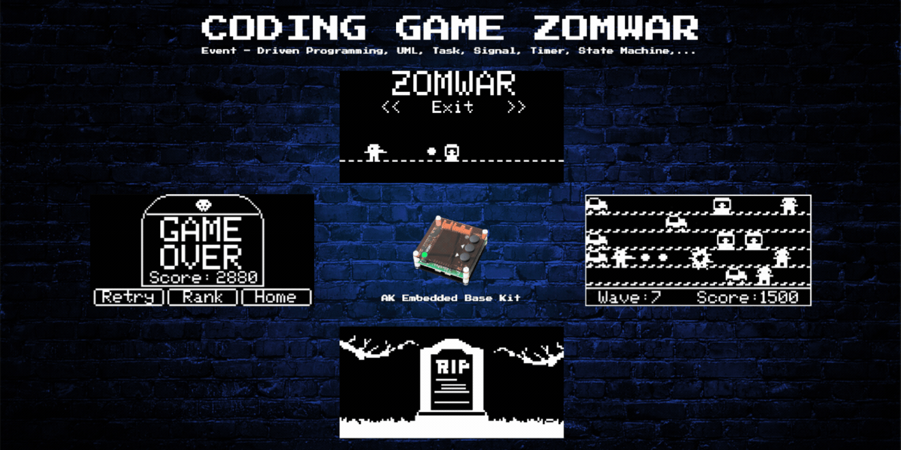
</center>

<hr>

## Gameplay Demo

<!-- <div align="center">
    <video src="https://github.com/ak-embedded-software/archery-game/assets/54855481/d493703c-bf5b-4fd2-ae04-b86784a01231" alt="epcb archery game" height=200/>
</div> -->

## Documentation

| File | Description |
|---|---|
| [README.md](README.md) | Main project overview, hardware information, gameplay rules, and object descriptions. |
| [docs/getting_started.md](docs/getting_started.md) | Runtime sequence diagrams for gameplay objects: Gunner, Bullet, Zombie, Car, Bang, Tombstone, and Border. |
| [docs/object_sequence.md](docs/object_sequence.md) | Runtime sequence diagrams for gameplay objects: Gunner, Bullet, Zombie, Car, Bang, Tombstone, and Border. |
| [docs/runtime_signal_processing.md](docs/runtime_signal_processing.md) | Runtime signal-processing flow for button input, AK task messages, timers, game-loop ticks, object updates, and Mermaid sequence diagrams. |

## Introduction

Zomwar is an action survival game built on top of the AK Embedded Base Kit — a hands-on platform for embedded programming enthusiasts to explore event-driven design in depth. While building and playing Zomwar, you put the following core concepts of modern embedded engineering into practice:

- **System design:** Modelling complex logic flows with UML.
- **Process management:** Coordinating cooperative Tasks and scheduling them efficiently.
- **Communication:** Using Signals, Timers, and Messages to react in real time.
- **Control logic:** Building robust state machines for the player, the Zombies, and the overall match progression.

### I. Hardware

<table align="center">
  <tr>
    <td align="center"></td>
  </tr>
</table>
<p align="center"><strong><em>Figure 1:</em></strong> AK Embedded Base Kit - STM32L151</p>

[AK Embedded Base Kit](https://epcb.vn/products/ak-embedded-base-kit-lap-trinh-nhung-vi-dieu-khien-mcu) is an evaluation kit aimed at intermediate and advanced embedded software learners.

The kit integrates a **1.54" OLED LCD**, **3 push buttons**, and **a buzzer** capable of playing short melodies, giving you everything you need to study **event-driven systems** through hands-on game-machine design.
It also exposes **RS485**, the **Qwiic Connect System**, and **Grove** connectors, so it doubles as a convenient prototyping board for real-world embedded projects.

**MCU Overview:**

```text
SoC Name : STM32L151CBT6
RAM      : 16 KB

Flash Partitions Layout
----------------------
[ 0x08000000 - 0x08001FFF ] : Bootloader Partition (8 KB)
=> AK Bootloader

[ 0x08002000 - 0x08002FFF ] : BSF Shared Partition (4 KB)
=> Used for data sharing between Bootloader and Application

[ 0x08003000 - 0x0801FFFF ] : Application Partition (116 KB)
=> Zomwar firmware
```

**MCU Naming Convention:**

| Part | Meaning |
|---|---|
| `STM32` | STMicroelectronics 32-bit MCU family. |
| `L` | Low-power series. |
| `151` | STM32L151 product line. |
| `C` | 48-pin package. |
| `B` | 128 KB Flash memory. |
| `T` | LQFP package. |
| `6` | Industrial temperature grade. |


<table align="center">
  <tr>
    <td align="center"></td>
  </tr>
</table>
<p align="center"><strong><em>Figure 2:</em></strong> Board view Top + Bottom </p>

### II. Game Description and Objects

The following section describes the gameplay and core mechanics of **"Zomwar"**. It serves as a reference for ongoing game design and firmware development.

<table align="center">
  <tr>
    <td align="center">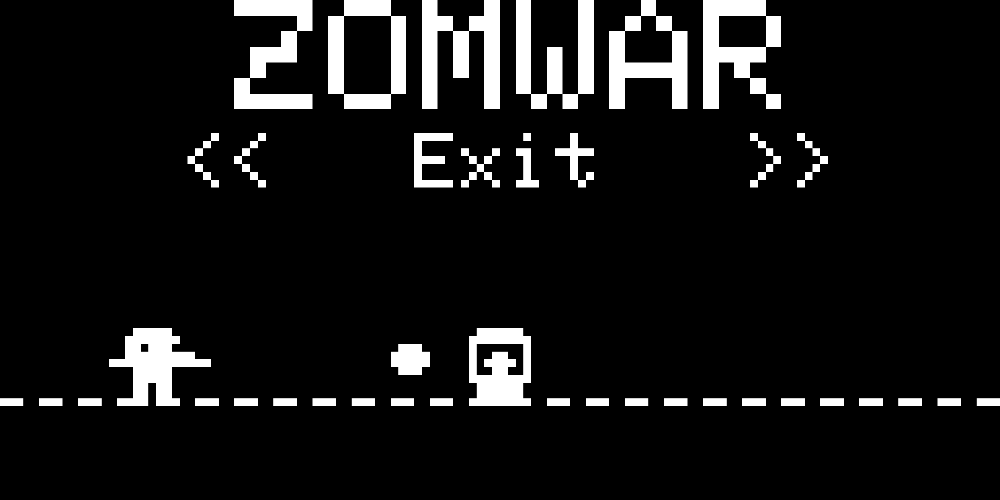</td>
  </tr>
</table>
<p align="center"><strong><em>Figure 3:</em></strong> Menu screen</p>

The game opens on the **Main Menu**, which offers the following options:

- **Play:** Start a new match.
- **Setting:** Configure gameplay parameters such as starting difficulty and sound.
- **Rank:** View the top 3 highest scores.
- **Exit:** Leave the menu and return to the idle screen.

<table align="center">
  <tr>
    <td align="center">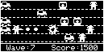</td>
  </tr>
</table>
<p align="center"><strong><em>Figure 4:</em></strong> Gameplay screen</p>

#### Objects in the Game:

| Bitmap | Object Name | Type | Description |
| :---: | :--- | :--- | :--- |
| 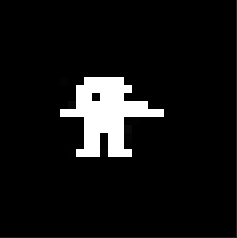 | **Gunner** | Player | The player character, positioned on the left side of the screen. Moves vertically to line up with one of the 5 firing rows and shoots Bullets when the player presses **[Mode]**. |
| 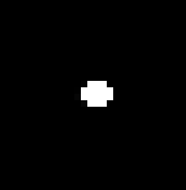 | **Bullet** | Projectile | Projectile fired by the Gunner. Flies to the right and destroys any Zombie it touches. |
| 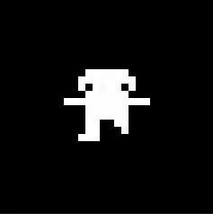 | **Zombie** | Enemy | The main enemy. Walks left toward the Border with a slight zigzag motion along the Y axis, and gets faster after every wave. Each Zombie destroyed is worth **10 points**. |
| 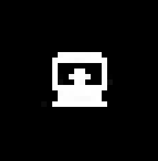 | **Tombstone** | Spawner | A static graveyard tile placed on the map (up to 2 per lane). While active, it periodically makes a new Zombie rise out of the grave into its lane. Which Tombstones are active can be configured in **Setting**. |
| 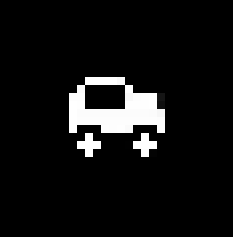 | **Car** | Defense | A defensive vehicle parked on the left edge of a lane. When a Zombie reaches the left edge (or rams the parked car), the nearest available Car switches on and drives right, crushing every Zombie in its lane before leaving the screen — single use. Which lanes start with a Car is configured in **Setting**. |
| 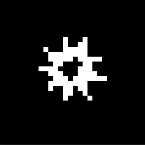 | **Bang** | Effect | A short impact animation drawn wherever a Zombie is destroyed (by a Bullet or by a Car). Purely visual — it has no gameplay effect on its own. |
| 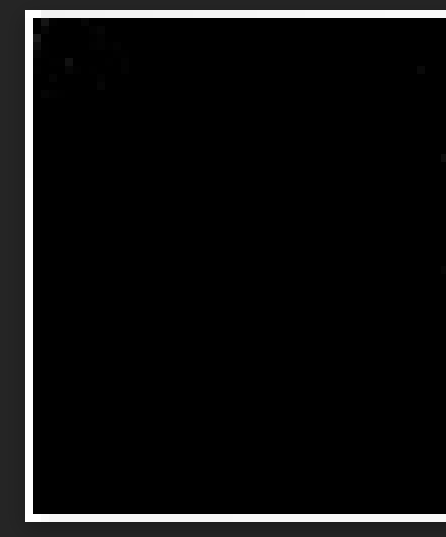 | **Border** | Environment | The safe zone along the left edge that must be protected. The match ends the moment a Zombie crosses the Border in a lane that has no Car left. |

> **Note:** For detailed object runtime sequences, see [Game Object Sequences](docs/object_sequence.md).

### III. How to Play:

- You control the **Gunner**. Use the **[Up]** and **[Down]** buttons to move between the 5 firing rows. Holding either button moves the Gunner faster.
- Press the **[Mode]** button to fire a **Bullet** at the incoming **Zombies**.
- Zombies appear from the right edge of the screen and also rise up from any active **Tombstones** on the map.
- The goal is to score as many points as possible. The match ends when a Zombie crosses the **Border** in a lane that no longer has a **Car** to defend it.

#### Game Mechanics:

- **Scoring:** Each Zombie destroyed — whether by a Bullet or by a Car — is worth **10 points**. The running score is shown in the bottom-right corner of the screen, and the total kill count in the bottom-left corner.
- **Waves & difficulty:** Every **200 points**, a warning blinks on screen, a fresh batch of Zombies is spawned, and the Zombie movement speed goes up by one level (capped at level 6). The starting speed can be customised in the **Setting** menu.
- **Cars as a second line of defence:** A Car parked on a lane stays still until a Zombie reaches the left edge of that lane (or runs into the Car). It then drives across the lane once, crushes every Zombie in its path, and exits the screen — meaning each Car can only save the lane one time. Use **Setting** to choose which lanes start with a Car.
- **Tombstones as Zombie spawners:** Tombstones sit at fixed positions on the map; every active Tombstone occasionally lifts a new Zombie out of the grave into its lane. Toggle individual Tombstones on or off in **Setting**.
- **Animation:** To keep the action lively, the Gunner, the Zombies, and the Cars all play sprite animations while they move.
- **Game Over:** When a Zombie crosses the Border in an undefended lane, the match ends, the objects reset, and the score is saved. A short **"RIP"** screen plays before the **Game Over** screen, which offers 3 options:
    - **Retry:** play again.
    - **Rank:** view the leaderboard.
    - **Home:** return to the main menu.

> **Note:** In the latest game version, a "RIP" screen plays before the Game Over screen — try to score as many points and survive as long as possible to earn praise.

<table align="center">
  <tr>
    <td align="center">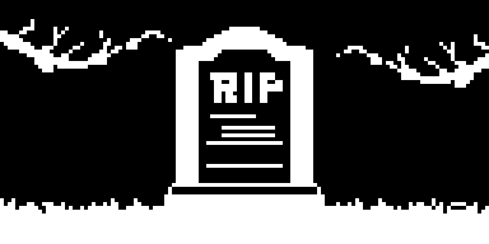</td>
  </tr>
</table>
<p align="center"><strong><em>Figure 5:</em></strong> Game Over screen 1</p>

<table align="center">
  <tr>
    <td align="center">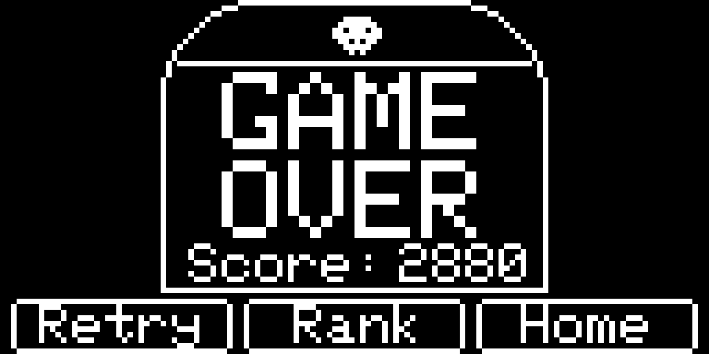</td>
  </tr>
</table>
<p align="center"><strong><em>Figure 6:</em></strong> Game Over screen 2</p>

### IV. Basic Game Sequence Logic

> **Note:** For a more detailed sequence flow, see [Runtime Signal Processing](docs/runtime_signal_processing.md).

<table align="center">
  <tr>
    <td align="center">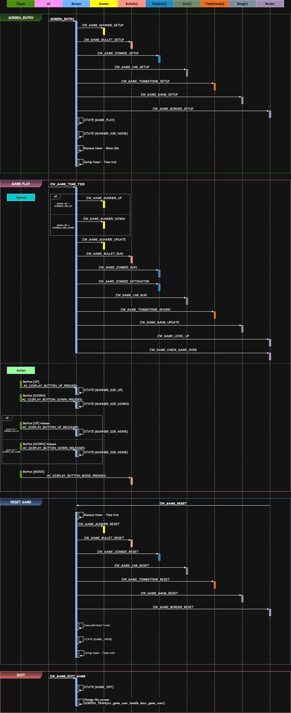</td>
  </tr>
</table>
<p align="center"><strong><em>Figure 7:</em></strong> Game sequence logic</p>

## Contact & Support

<p style="font-size: 20px;"><strong>Cao Trong Phuoc</strong> - Software Engineer - Embedded Systems</p>

``` Note
Thank you for visiting this repository.
If you have any questions, suggestions, or feedback about this project or firmware development, feel free to contact me directly.
```

<a href="https://github.com/caotrongphuoc">
  
</a>

<a href="https://www.linkedin.com/in/cao-trong-phuoc/">
  
</a>

<a href="mailto:caotrongphuoc@gmail.com">
  
</a>
