<h1 align="center">Coding rules and style guide</h1>

This document defines the naming conventions, code style, commit message format, and document naming conventions used in the project, along with instructions for installing and using `clang-format`. The goal is to keep code from all contributors visually consistent and easy to track through search tools, code review, and version control. These are takeaways from finishing the Zomwar game; feel free to refer to and adopt whatever fits your work.

---

## Table of contents

- [I. Naming conventions](#i-naming-conventions)
  - [1. Folder](#1-folder)
  - [2. Source and header files](#2-source-and-header-files)
  - [3. Header guard](#3-header-guard)
  - [4. Macros and compile-time constants](#4-macros-and-compile-time-constants)
  - [5. Signal (enum values)](#5-signal-enum-values)
  - [6. Task ID](#6-task-id)
  - [7. Data types and typedef](#7-data-types-and-typedef)
  - [8. Functions](#8-functions)
  - [9. Variables](#9-variables)
- [II. Code style (clang-format)](#ii-code-style-clang-format)
- [III. Installing clang-format](#iii-installing-clang-format)
- [IV. Running clang-format](#iv-running-clang-format)
- [V. Commit message convention](#v-commit-message-convention)
- [VI. Document file naming convention](#vi-document-file-naming-convention)
- [VII. References](#vii-references)

---

## I. Naming conventions

The conventions below are taken directly from the existing source code. New code must follow them so that tooling, search, and reviewers all work consistently.

**Case styles used in this document:**

| Style | Description | Example in project | Applied to |
|---|---|---|---|
| `lower_snake_case` | Lowercase letters, words separated by underscore `_` | `wave_warning_active`, `zw_game_score` | Variables, functions, typedefs, source file names, folder names |
| `UPPER_SNAKE_CASE` | Uppercase letters, words separated by underscore `_` | `BULLET_NUMBER`, `ZW_GAME_BORDER_SETUP`, `AC_TASK_DISPLAY_ID` | `#define` constants, signal enums, task IDs, macros |
| `kebab-case` | Lowercase letters, words separated by hyphen `-` | `02-guide-coding-rules.md` | Documentation file names under `docs/` |

### 1. Folder

Folders use `lower_snake_case`. Organize by feature (feature-based), not by file type.

```
application/sources/app/
  game/
    game_<game_name>/     # folder holding the source code of all objects of a game,
                          # e.g. game_zomwar
  screens/                # folder holding the source code of all display screens
  ...
```

### 2. Source and header files

Source and header files always carry a module prefix so you can identify the module at a glance:

| Prefix | Meaning | Example |
|---|---|---|
| `scr_*` | Handler of a screen | `scr_game_zomwar.cpp`, `scr_game_over.h` |
| `zw_game_*` | Object belonging to the Zomwar game | `zw_game_bang.cpp`, `zw_game_border.h` |

Each game defines its own short prefix (for example `zw_game_*` for Zomwar) and applies it consistently to every file in that game's folder.

File extensions: `.h` for headers, `.cpp` for implementation (the project is built as C++).

### 3. Header guard

Use the pattern `__<FILE_NAME>_H__`, entirely uppercase, matching the file name exactly:

```cpp
#ifndef __ZW_GAME_BANG_H__
#define __ZW_GAME_BANG_H__
...
#endif //__ZW_GAME_BANG_H__
```

### 4. Macros and compile-time constants

Use `UPPER_SNAKE_CASE`. Always wrap numeric values in parentheses to avoid expansion bugs.

**Mandatory rule: a macro belonging to an object MUST carry that object's name as a prefix.**

Pattern: `<OBJECT>_<PROPERTY>` or `<OBJECT>_<ACTION>` — the object always comes first. Reading the macro name immediately tells you which module it belongs to, and grepping by object name returns every constant of that module.

| Constant type | Correct form |
|---|---|
| Count | `ZOMBIE_NUMBER`, `BULLET_NUMBER`, `BANG_NUMBER` |
| Coordinate | `GUNNER_AXIS_X`, `CAR_AXIS_X` |
| Movement step | `GUNNER_STEP_AXIS_Y`, `BULLET_STEP_AXIS_X` |
| Bitmap size | `GUNNER_SIZE_BITMAP_X`, `BANG_SIZE_BITMAP_I_X` |
| Time / interval | `BORDER_WAVE_SCORE_INTERVAL`, `TOMBSTONE_SPAWN_INTERVAL` |
| Behavior / limit | `ZOMBIE_RISE_TICKS`, `ZOMBIE_SPEED_MAX`, `CAR_HIT_RANGE_Y` |

Examples done right:

```cpp
// zw_game_bullet.h
#define BULLET_NUMBER              (15)
#define BULLET_MAX_AXIS_X          (128)
#define BULLET_STEP_AXIS_X         (3)
#define BULLET_SIZE_BITMAP_X       (5)
#define BULLET_SIZE_BITMAP_Y       (5)

// zw_game_gunner.h
#define GUNNER_STEP_AXIS_Y         (10)
#define GUNNER_AXIS_X              (14)
#define GUNNER_AXIS_Y              (52)
#define GUNNER_AXIS_Y_MIN          (12)
#define GUNNER_AXIS_Y_MAX          (52)
#define GUNNER_SIZE_BITMAP_X       (25)
#define GUNNER_SIZE_BITMAP_Y       (10)

// zw_game_border.h
#define BORDER_WAVE_SCORE_INTERVAL    (200)
#define BORDER_WARNING_BLINK_DURATION (30)
#define BORDER_WARNING_BLINK_RATE     (3)
#define BORDER_SIZE_BITMAP_WARNING_X  (16)
#define BORDER_SIZE_BITMAP_WARNING_Y  (14)
```

**Exception — system / project level macros:** macros belonging to the whole game (not tied to any specific object) use the project prefix `ZW_GAME_*`:

```cpp
#define ZW_GAME_TIME_TICK_INTERVAL (100)
#define ZW_GAME_TIME_EXIT_INTERVAL (3000)
```

Group related constants into the right module header (`zw_game_bullet.h` holds bullet constants, `zw_game_gunner.h` holds gunner constants, and so on). Never leave magic numbers scattered across `.cpp` files.

### 5. Signal (enum values)

Signals are the **public contract** between tasks. Always use the full prefix — no abbreviations, not in comments, not in documentation, not in sequence diagrams.

| Pattern | Applied to | Example |
|---|---|---|
| `<GAME>_<OBJECT>_<ACTION>` | Per-game signal | `ZW_GAME_BORDER_CHECK_GAME_OVER` |

Declare each task's signal set in `app.h` as its own enum block, anchored to `ZW_GAME_DEFINE_SIG` (or `AK_USER_DEFINE_SIG` for the framework group):

```cpp
/*****************************************************************************/
/*  Zomwar game 'BORDER' task define
 */
/*****************************************************************************/
enum {
    ZW_GAME_BORDER_SETUP = ZW_GAME_DEFINE_SIG,
    ZW_GAME_BORDER_CHECK_GAME_OVER,
    ZW_GAME_BORDER_CHECK_WAVE,
    ZW_GAME_BORDER_LEVEL_UP,
    ZW_GAME_BORDER_RESET,
};
```

### 6. Task ID

Use the pattern `<PREFIX>_<NAME>_ID`, entirely uppercase, registered in `task_list.h`:

```cpp
AC_TASK_DISPLAY_ID
ZW_GAME_GUNNER_ID
ZW_GAME_BORDER_ID
```

The corresponding handler in `task_list.cpp` keeps the same name, swapping the `_ID` suffix for `_handle` and lowercasing it:

```cpp
{ZW_GAME_BORDER_ID, TASK_PRI_LEVEL_4, zw_game_border_handle},
```

### 7. Data types and typedef

Use `lower_snake_case` with the `_t` suffix. Leave the struct anonymous; the typedef is the public name:

```cpp
typedef struct
{
    uint8_t x;
    uint8_t y;
    uint8_t action_image;
    bool    visible;
} zw_game_gunner_t;
```

Framework-provided types follow the same pattern (`ak_msg_t`, `view_screen_t`).

### 8. Functions

Use `lower_snake_case` with the module name as prefix, so grepping the prefix returns every entry point of that module:

```cpp
void   zw_game_border_handle(ak_msg_t* msg);
void   zw_game_bang_spawn(int16_t x, uint8_t y);
void   zw_game_zombie_spawn_from_tombstone(uint8_t i, int16_t x, uint8_t y);
int8_t zw_game_car_find_nearest(uint8_t zy);
```

### 9. Variables

Use `lower_snake_case`. Do not start names with an underscore.

- **Global variables shared between modules:** declare `extern` in the header, define exactly once in the owning module's `.cpp`.

  ```cpp
  // zw_game_border.h
  extern uint16_t zw_game_score;
  extern uint8_t  wave_level;
  extern bool     wave_warning_active;
  ```

- **Module-internal variables:** declare `static` in the `.cpp`.

  ```cpp
  // scr_game_zomwar.cpp
  static uint8_t zw_game_state;
  static uint8_t gunner_dir = GUNNER_DIR_NONE;
  ```

- **Local variables:** short and descriptive of the role. Loop counters can use `i`, `j`, `k` when the scope is clear.

State belonging to a task's object should carry that object's name (`gunner.y`, `bang[i].visible`, `wave_warning_timer`); do not stash cross-cutting state inside another module's `.cpp`.

---

## II. Code style (clang-format)

The repo already ships a `.clang-format` file at the root, shown here for reference:

```yaml
Language: Cpp
BasedOnStyle: LLVM
UseTab: ForIndentation
IndentWidth: 4
TabWidth: 4
ColumnLimit: 0
BreakBeforeBraces: Allman
AllowShortIfStatementsOnASingleLine: false
AllowShortFunctionsOnASingleLine: None
AllowShortBlocksOnASingleLine: false
AllowShortCaseLabelsOnASingleLine: false
PointerAlignment: Left
SpaceBeforeParens: ControlStatements
IndentCaseLabels: false
SortIncludes: false
```

What the non-default settings do:

| Setting | Effect |
|---|---|
| `UseTab: ForIndentation`, `IndentWidth: 4`, `TabWidth: 4` | Tabs are used only for indentation, not alignment. One tab equals 4 columns. |
| `ColumnLimit: 0` | No automatic line wrapping. The author decides where to break lines. |
| `BreakBeforeBraces: Allman` | The `{` always sits on its own line — applies to `if`, `for`, and function bodies. |
| `AllowShort*OnASingleLine: false` | One statement per line, including short `if` statements and empty functions. |
| `PointerAlignment: Left` | Write `int* p`, not `int *p`. |
| `SpaceBeforeParens: ControlStatements` | `if (x)`, `for (...)` get a space; `func(x)` does not. |
| `IndentCaseLabels: false` | `case` labels sit at the same indent level as `switch`. |
| `SortIncludes: false` | Include order is meaningful (BSP → framework → project) and must not be sorted automatically. |

---

## III. Installing clang-format

Instructions for Linux (Ubuntu / Debian).

Install:

```bash
sudo apt update
sudo apt install clang-format
```

<table align="center">
  <tr>
    <td align="center">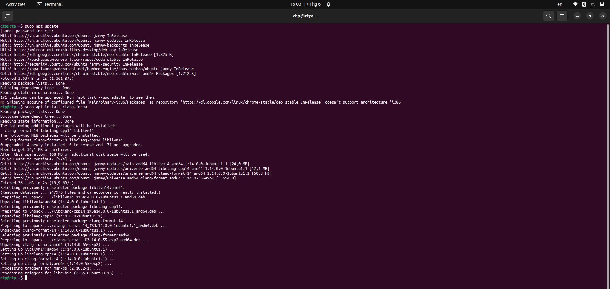</td>
  </tr>
</table>
<p align="center"><strong><em>Figure 1:</em></strong> Installing clang-format</p>

Verify the install:

```bash
clang-format --version
```

Expected output (the version number may differ):

```
Ubuntu clang-format version 14.x.x
```

<table align="center">
  <tr>
    <td align="center">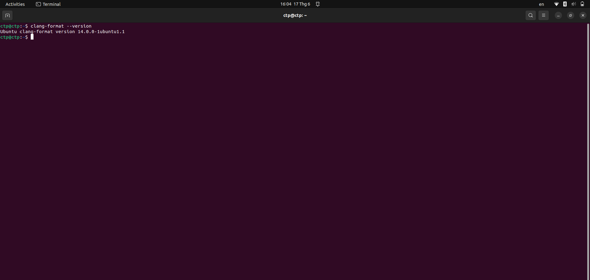</td>
  </tr>
</table>
<p align="center"><strong><em>Figure 2:</em></strong> Checking the clang-format version</p>

---

## IV. Running clang-format

### 1. Running from the command line

Format a single file in place:

```bash
clang-format -i application/sources/app/game/game_zomwar/zw_game_bullet.cpp
```

<table align="center">
  <tr>
    <td align="center">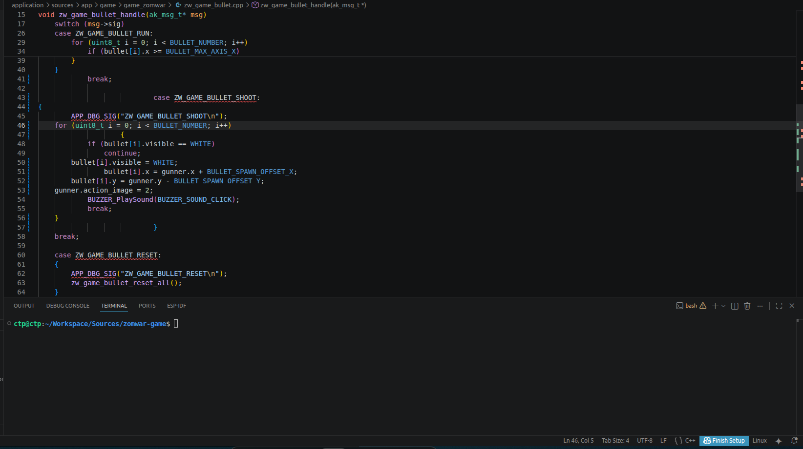</td>
    <td align="center">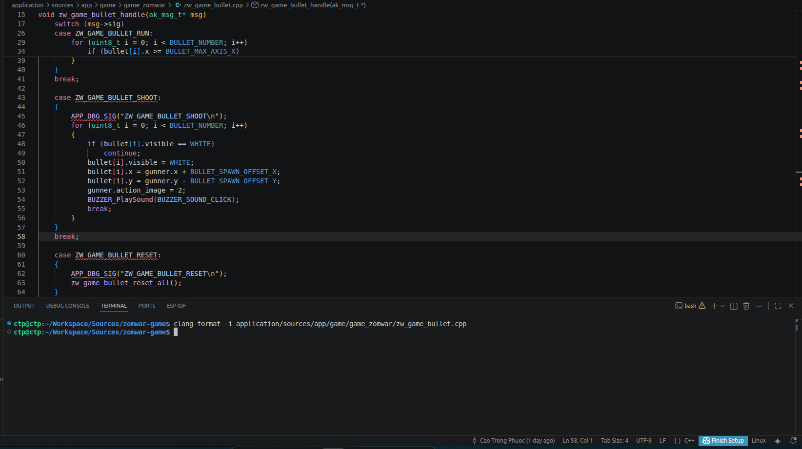</td>
  </tr>
  <tr>
    <td align="center"><strong><em>Before format</em></strong></td>
    <td align="center"><strong><em>After format</em></strong></td>
  </tr>
</table>
<p align="center"><strong><em>Figure 3:</em></strong> Comparison before and after formatting a single file</p>

Format every source and header file under `application/sources/app`:

```bash
find application/sources/app -type f \( -name "*.cpp" -o -name "*.h" \) \
    -not -path "*/libraries/*" \
    -exec clang-format -i {} +
```

<table align="center">
  <tr>
    <td align="center">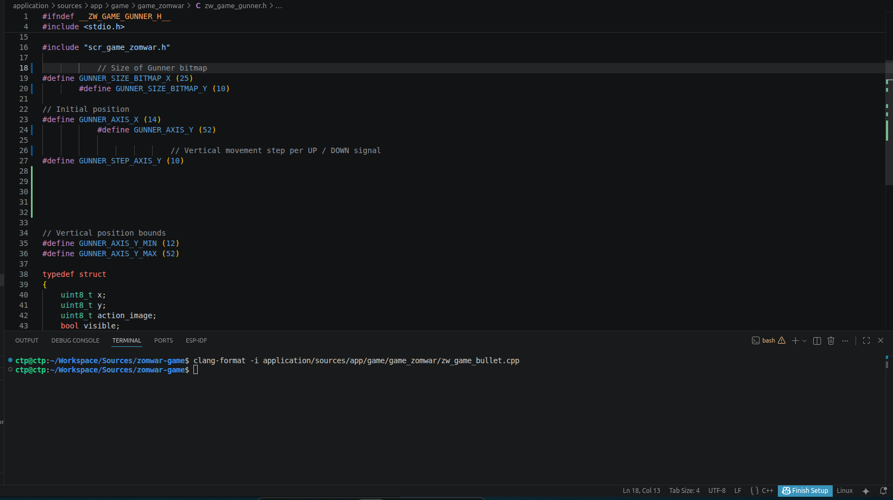</td>
    <td align="center">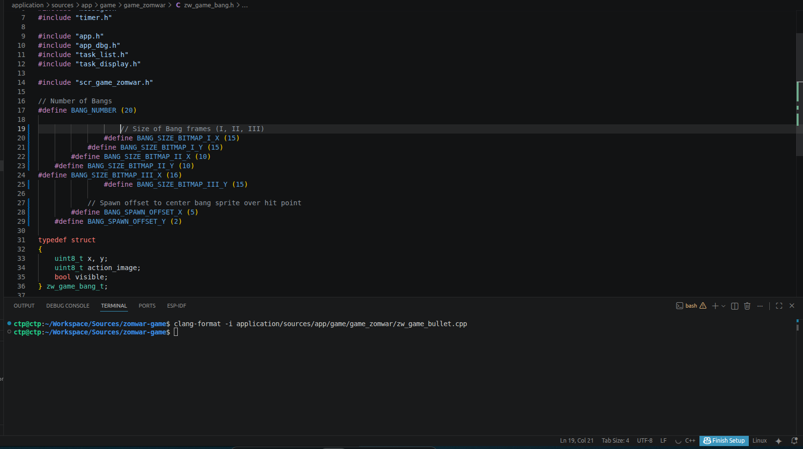</td>
  </tr>
  <tr>
    <td align="center"><strong><em>Before format (1)</em></strong></td>
    <td align="center"><strong><em>Before format (2)</em></strong></td>
  </tr>
</table>
<p align="center"><strong><em>Figure 4:</em></strong> Source code state before bulk formatting</p>

<table align="center">
  <tr>
    <td align="center">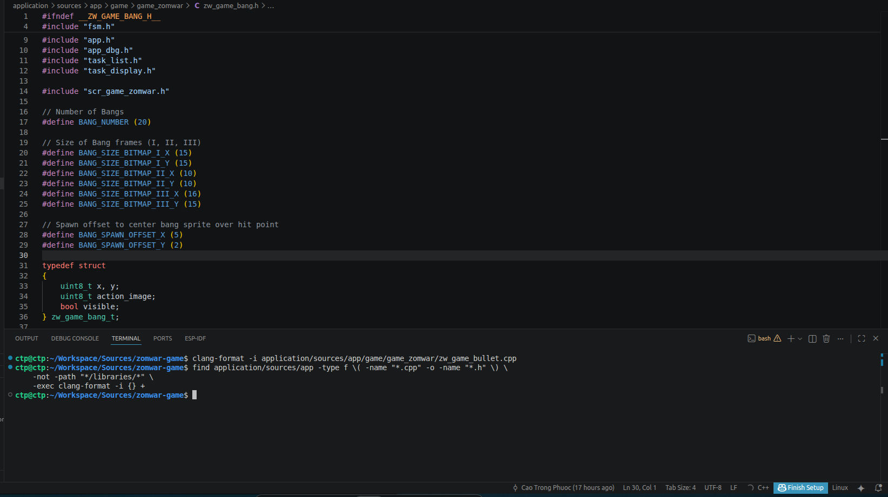</td>
    <td align="center">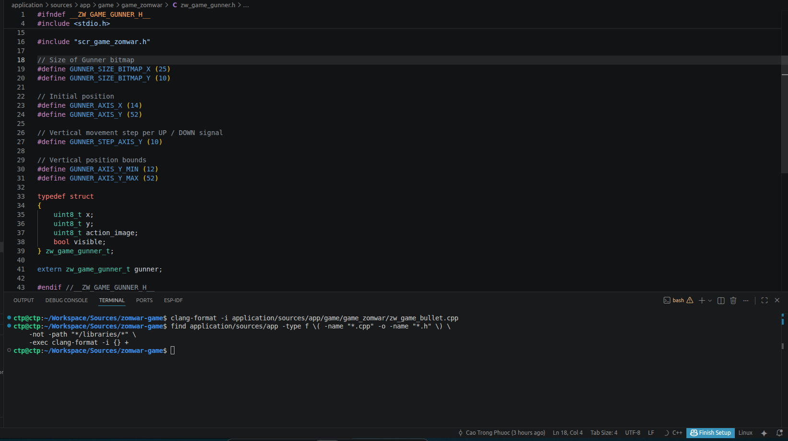</td>
  </tr>
  <tr>
    <td align="center"><strong><em>After format (1)</em></strong></td>
    <td align="center"><strong><em>After format (2)</em></strong></td>
  </tr>
</table>
<p align="center"><strong><em>Figure 5:</em></strong> Source code state after bulk formatting</p>

### 2. VSCode integration

**Step 1.** Install the **C/C++** extension (Microsoft) — it bundles `clang-format` and automatically picks up the `.clang-format` file in the repo.

<table align="center">
  <tr>
    <td align="center">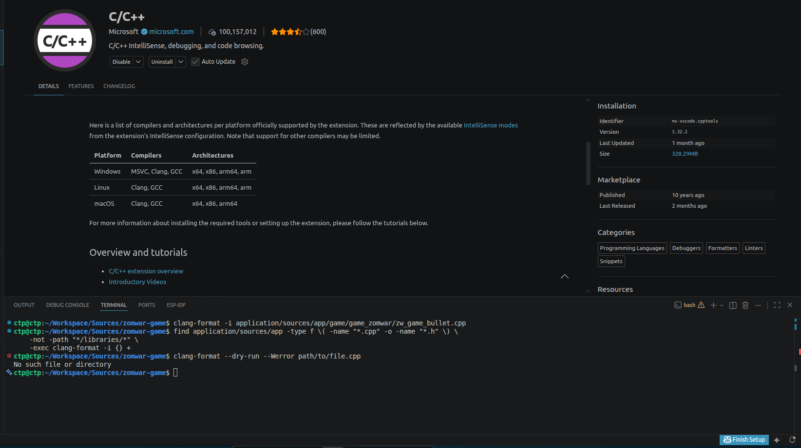</td>
  </tr>
</table>
<p align="center"><strong><em>Figure 6:</em></strong> Installing the C/C++ extension</p>

**Step 2.** Open the workspace settings (`.vscode/settings.json`) and add the following:

```json
{
    "editor.formatOnSave": true,
    "editor.defaultFormatter": "ms-vscode.cpptools",
    "C_Cpp.clang_format_style": "file",
    "C_Cpp.clang_format_fallbackStyle": "LLVM"
}
```

<table align="center">
  <tr>
    <td align="center">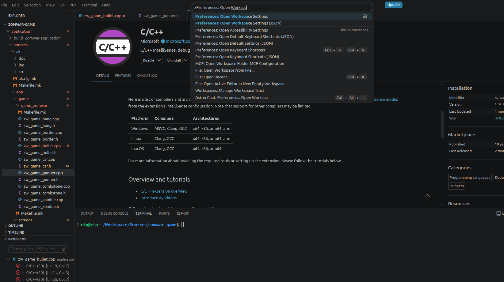</td>
  </tr>
</table>
<p align="center"><strong><em>Figure 7:</em></strong> Opening the workspace settings file</p>

<table align="center">
  <tr>
    <td align="center">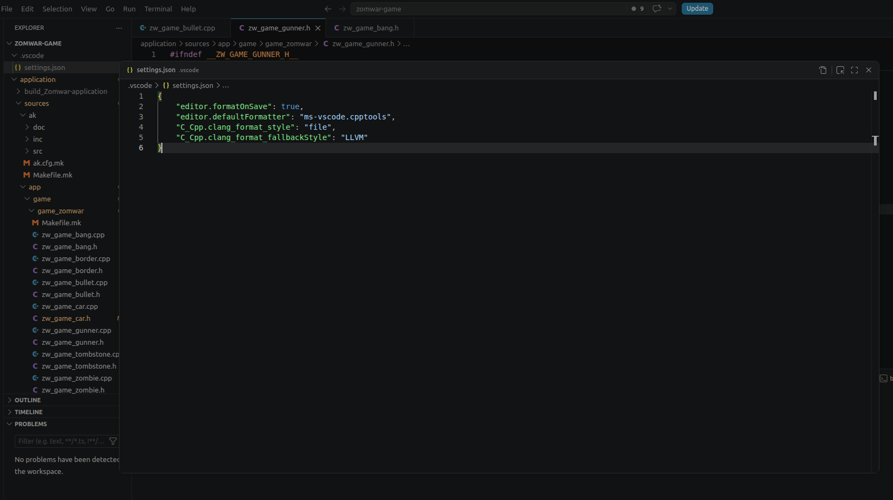</td>
  </tr>
</table>
<p align="center"><strong><em>Figure 8:</em></strong> The JSON configuration contents</p>

**Step 3.** Format the current file with the shortcut <kbd>Ctrl</kbd>+<kbd>Shift</kbd>+<kbd>I</kbd> (Windows / Linux).

<table align="center">
  <tr>
    <td align="center">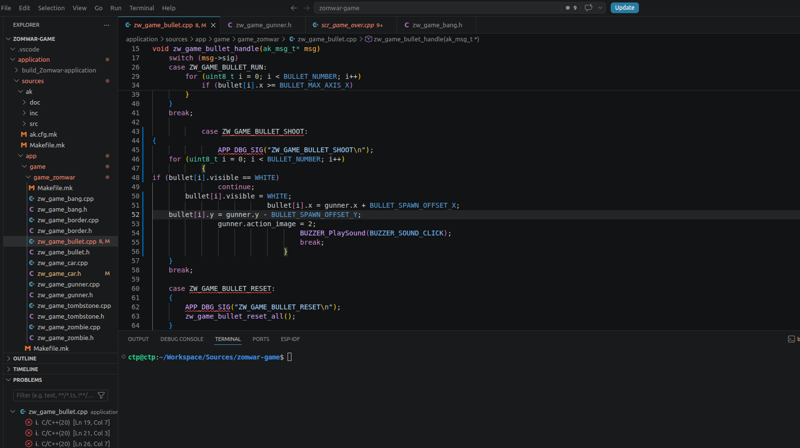</td>
    <td align="center">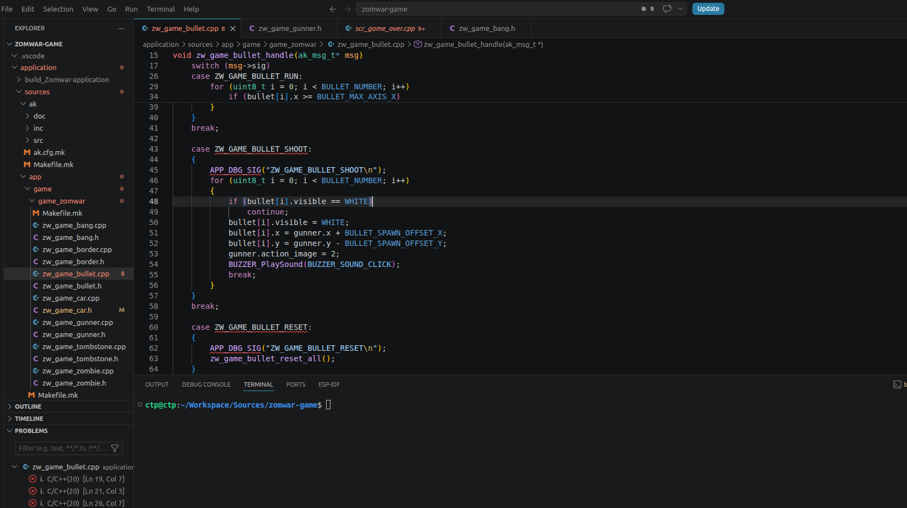</td>
  </tr>
  <tr>
    <td align="center"><strong><em>Before format</em></strong></td>
    <td align="center"><strong><em>After format with <kbd>Ctrl</kbd>+<kbd>Shift</kbd>+<kbd>I</kbd></em></strong></td>
  </tr>
</table>
<p align="center"><strong><em>Figure 9:</em></strong> Comparison before and after formatting with the shortcut</p>

**Step 4.** Turn on `formatOnSave` so the editor formats on every save, which prevents committing code with stale formatting.

<table align="center">
  <tr>
    <td align="center">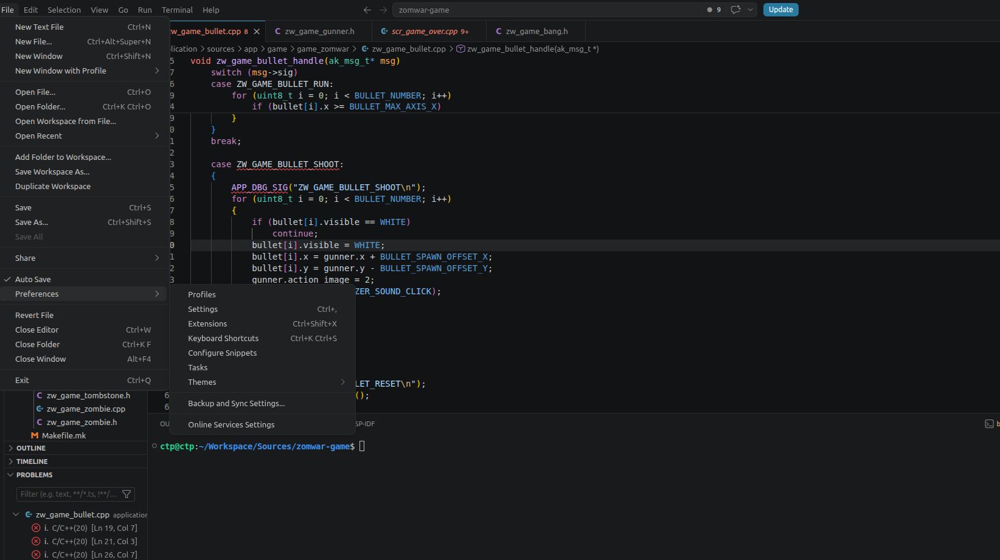</td>
  </tr>
</table>
<p align="center"><strong><em>Figure 10:</em></strong> Opening VSCode settings</p>

<table align="center">
  <tr>
    <td align="center">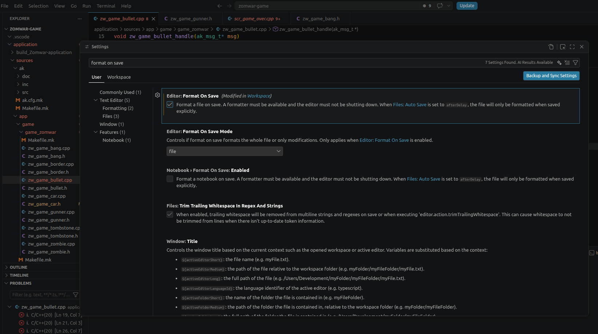</td>
  </tr>
</table>
<p align="center"><strong><em>Figure 11:</em></strong> Enabling the Format On Save option</p>

<table align="center">
  <tr>
    <td align="center">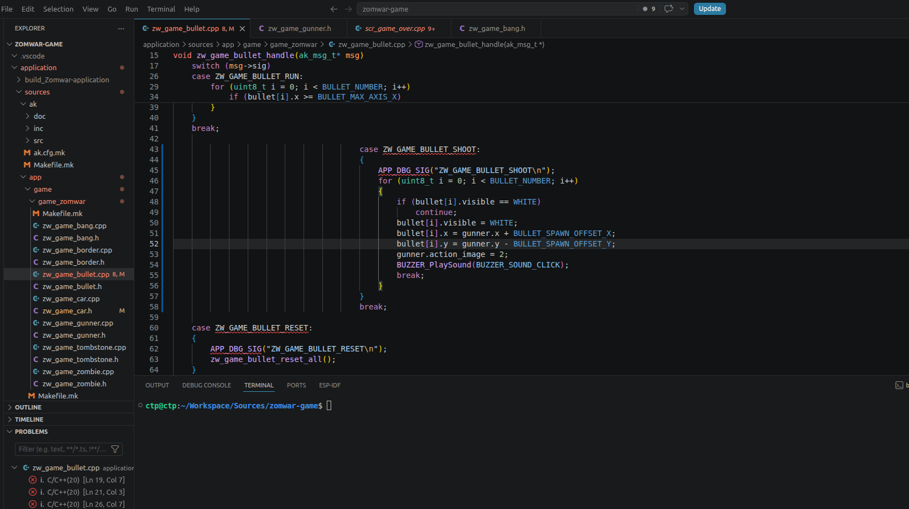</td>
    <td align="center">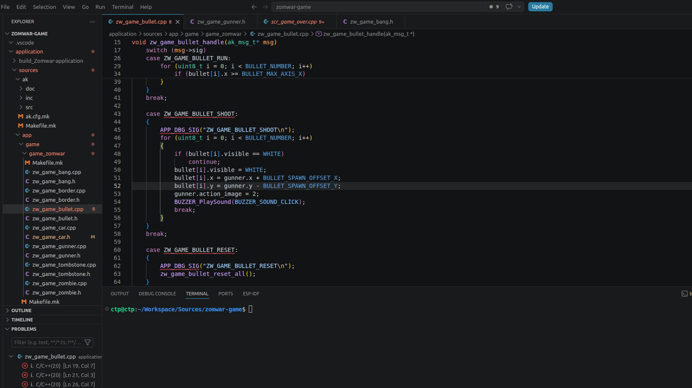</td>
  </tr>
  <tr>
    <td align="center"><strong><em>Before format</em></strong></td>
    <td align="center"><strong><em>After format (automatic on save)</em></strong></td>
  </tr>
</table>
<p align="center"><strong><em>Figure 12:</em></strong> Comparison before and after automatic formatting on save</p>

---

## V. Commit message convention

Every commit must follow the format `[ACTION] short description` so git history stays readable and filterable.

### 1. Workflow

```bash
git add .                                     # stage every change
git commit -m "[ACTION] short description"    # tag is mandatory, keep description short
git push                                      # push to remote
```

When you only need to stage specific files, replace `git add .` with `git add <path>` to avoid committing junk files by mistake.

### 2. Action tags

| Tag | When to use |
|---|---|
| `[ADD]` | Adding a new file, feature, asset, or document |
| `[UPDATE]` | Updating existing code — refactor, rename, tweak logic, bump version |
| `[FIX]` | Fixing an existing bug, a build error, or a formatting error |
| `[REMOVE]` | Removing a file, feature, or dead code |
| `[DOC]` | Documentation-only changes (`docs/`, `README.md`, large comment blocks) |
| `[MERGE]` | Branch merges (usually tool-generated, not hand-edited) |

### 3. Description style

- The tag is fully uppercase inside `[]`, followed by exactly one space, then the description.
- The description is lowercase, in the imperative mood (`add`, `fix`, `rename`, `move`...), with no trailing period.
- Keep the length around 70 characters — if it's longer, shorten it or move the details into the commit body.
- When you touch a specific module / signal / file, name it directly so the history is easy to grep.

### 4. Good examples

```text
[ADD] tombstone object sequence
[ADD] mermaid border sequence diagram
[UPDATE] rename Border signals to ZW_GAME_BORDER_*
[UPDATE] split Bang narrative into Setup/Per-tick/Reset
[UPDATE] enlarge runtime mermaid font size
[FIX] off-by-one in zombie zigzag clamp
[REMOVE] unused gunner_dir static in scr_idle
[DOC] coding rules and clang-format setup guide
```

### 5. Examples to avoid

```text
update                          # missing tag
[update] fix something          # tag must be uppercase
[ADD] Added new file.           # no past tense, no trailing period
[FIX] fix bug                   # too vague, no idea which bug
[ADD] zw_game_border.cpp + zw_game_zombie.cpp + scr_game_zomwar.cpp ... # too long, group by topic instead
```

---

## VI. Document file naming convention

Files in `docs/` follow the format `<NN>-<category>-<topic>.md`:

| Component | Convention | Example |
|---|---|---|
| `NN` | A 2-digit sequence number, starting from `01`. Reflects reading order — guides come first, design docs come after. | `01`, `02`, `03` |
| `category` | Document category. Only use predefined values; do not invent new categories. | `guide`, `design` |
| `topic` | The main topic, written in `kebab-case` (lowercase, words separated by `-`). | `getting-started`, `coding-rules`, `sequence-object` |

Categories currently in use:

| Category | Purpose | Typical content |
|---|---|---|
| `guide` | Workflow, setup, and process guides for contributors | Getting started, coding rules |
| `design` | Architecture and runtime behavior of the system | Sequence diagrams |

Files currently in the repo, as an example:

```
docs/
├── 01-guide-getting-started.md
├── 02-guide-coding-rules.md
├── 03-design-sequence-object.md
└── 04-design-sequence-runtime.md
```

A few important notes:

- Documentation files (`.md`) use `kebab-case` (hyphens). Source files and folders use `snake_case` (underscores). The difference is intentional: `kebab-case` is the standard convention for Markdown slugs and URLs.
- Images that go with a document live under `resources/images/<topic_dir>/`, where `<topic_dir>` follows the folder convention (snake_case). For example: `resources/images/getting_started/`.
- When adding a new document, continue the sequence number from the current maximum and keep the same category together so the reading order stays natural.
- Renaming a document file must be done with `git mv` so the rename history is tracked properly.

---

## VII. References

- [Naming convention — Multi-word identifiers (Wikipedia)](https://en.wikipedia.org/wiki/Naming_convention_(programming)#Multiple-word_identifiers) — the definitions of `snake_case`, `SCREAMING_SNAKE_CASE`, and `kebab-case` used in Sections I and VI.
- [Clang-Format — Configurable Format Style Options](https://clang.llvm.org/docs/ClangFormatStyleOptions.html#configurable-format-style-options) — describes every key in the `.clang-format` file from Section II.
- [LLVM Coding Standards — Source Code Formatting](https://llvm.org/docs/CodingStandards.html#source-code-formatting) — the base style inherited via `BasedOnStyle: LLVM` in Section II.
- [Pro Git — Recording Changes to the Repository](https://git-scm.com/book/en/v2/Git-Basics-Recording-Changes-to-the-Repository) — the `git add` / `git commit` / `git push` workflow used in Section V.

---

## Contact & Support

<p style="font-size: 20px;"><strong>Cao Trong Phuoc</strong> - Software Engineer - Embedded Systems</p>

```
Thanks for stopping by this repository.
If you have questions, suggestions, or feedback about the project
or about firmware development in general, feel free to reach out to me directly.
```

<a href="https://github.com/caotrongphuoc">
  
</a>

<a href="https://www.linkedin.com/in/cao-trong-phuoc/">
  
</a>

<a href="mailto:caotrongphuoc@gmail.com">
  
</a>
