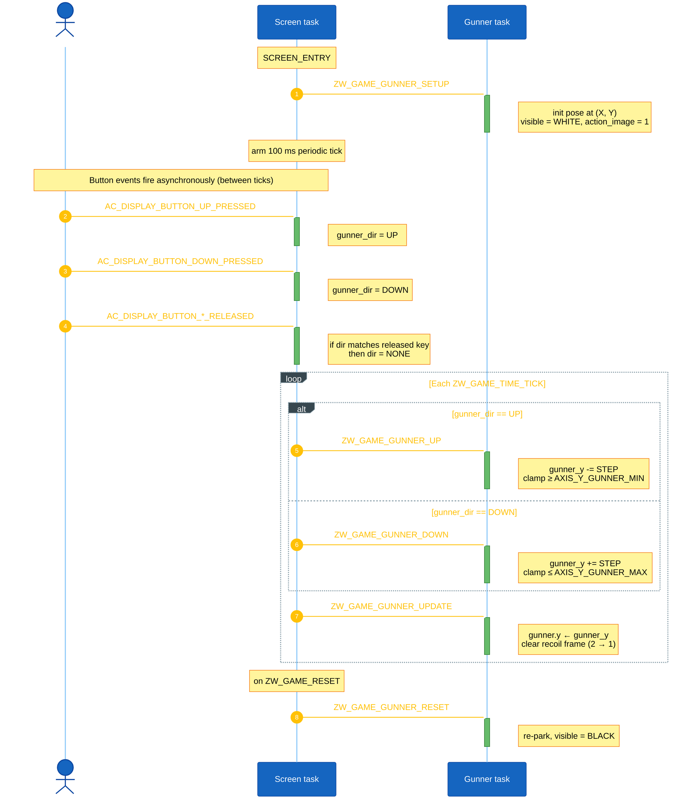
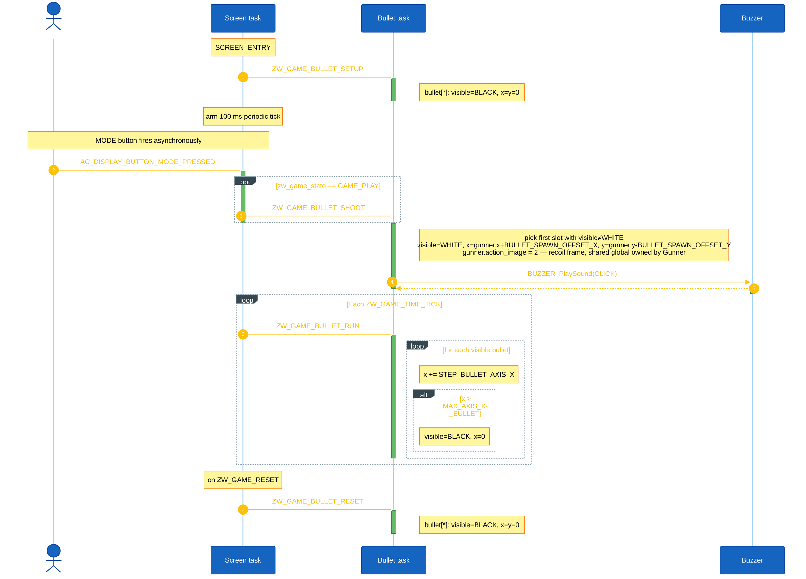
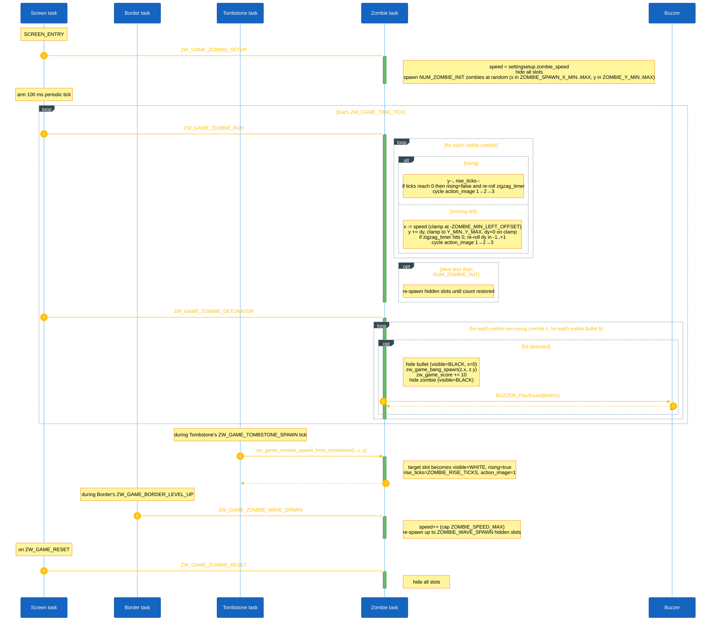
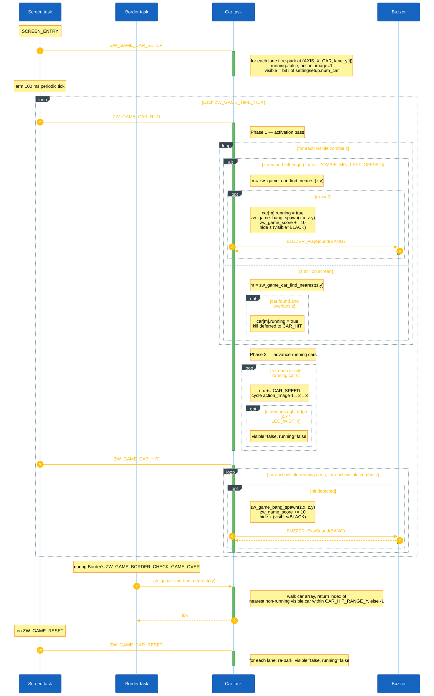
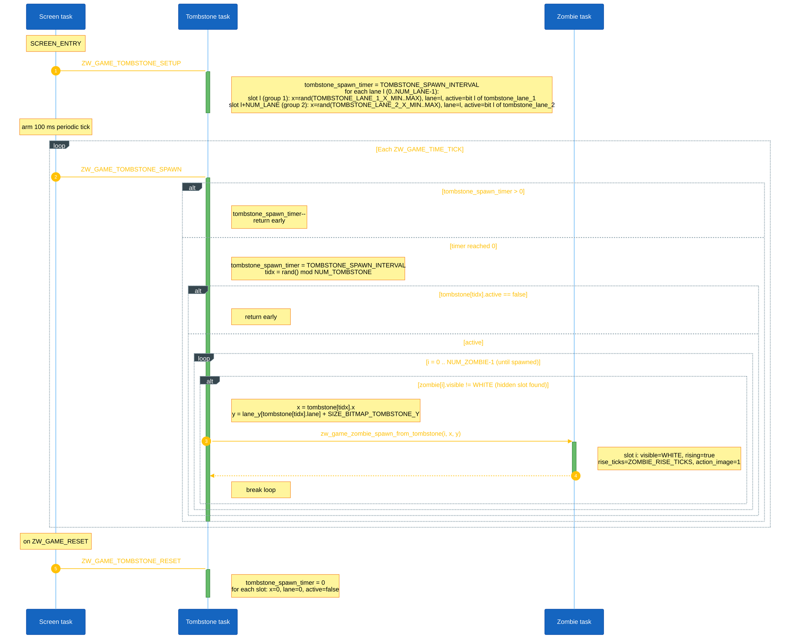
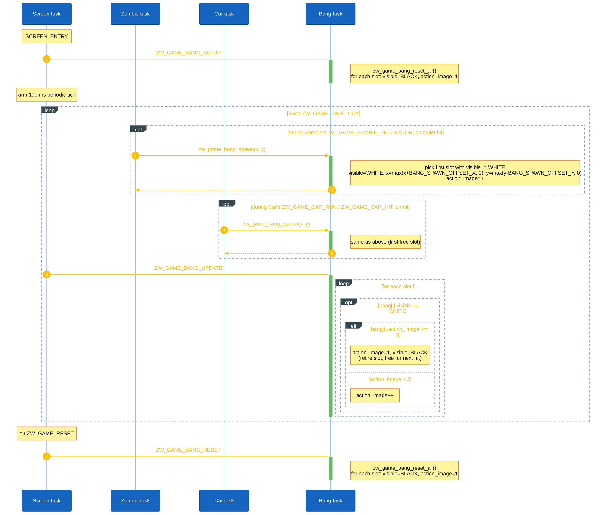
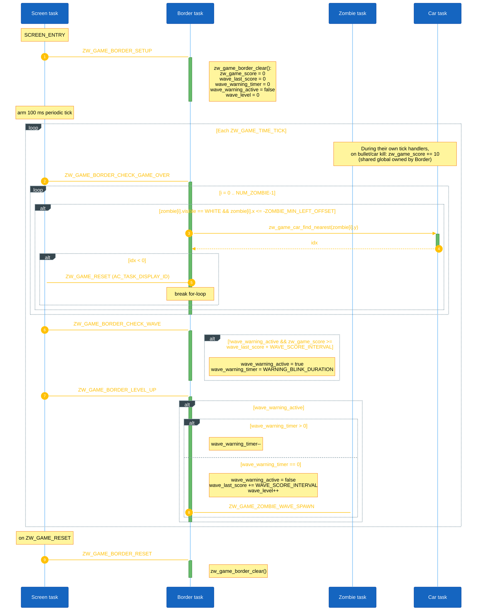

# Game Object Sequences

This document describes the runtime sequence of each main object in Zomwar. Each object is handled by its own AK task and receives signals from the screen task (`scr_game_zomwar`), button callbacks, the periodic game tick timer, or other object tasks.

## I. Object Summary

| Object | Task ID | Handler | Main responsibility |
|---|---|---|---|
| Gunner | `ZW_GAME_GUNNER_ID` | `zw_game_gunner_handle()` | Controls the player position and gunner image state. |
| Bullet | `ZW_GAME_BULLET_ID` | `zw_game_bullet_handle()` | Shoots bullets, moves active bullets, and hides them when they exit the screen. |
| Zombie | `ZW_GAME_ZOMBIE_ID` | `zw_game_zombie_handle()` | Spawns zombies, moves them (zigzag, rising from tombstones), checks collision with bullets, and updates score. |
| Bang | `ZW_GAME_BANG_ID` | `zw_game_bang_handle()` | Plays explosion animation after a zombie is hit. |
| Border | `ZW_GAME_BORDER_ID` | `zw_game_border_handle()` | Checks wave level-up and game-over conditions. |
| Car | `ZW_GAME_CAR_ID` | `zw_game_car_handle()` | Lawnmower-style rescue cars that activate when a zombie reaches the left edge or touches a parked car. |
| Tombstone | `ZW_GAME_TOMBSTONE_ID` | `zw_game_tombstone_handle()` | Spawns extra zombies that rise out of active tombstones. |

The screen task posts `ZW_GAME_TIME_TICK` every `ZW_GAME_TIME_TICK_INTERVAL` (100 ms). On each tick the screen task fans out signals to every object task in a fixed order.

## II. Gunner Object Sequence

Gunner owns the player position (`gunner` and the internal `gunner_y`).

**Setup.** `ZW_GAME_GUNNER_SETUP` parks the gunner at `(AXIS_X_GUNNER, AXIS_Y_GUNNER)` with `visible = WHITE`, `action_image = 1`.

**Input.** Button callbacks only update `gunner_dir` inside the screen task; they do not post to the Gunner task directly.

**Per-tick.** Each `ZW_GAME_TIME_TICK` the screen translates the latched `gunner_dir` into `ZW_GAME_GUNNER_UP` / `ZW_GAME_GUNNER_DOWN` (when non-zero) and always posts `ZW_GAME_GUNNER_UPDATE`.

- `UP` / `DOWN` — moves `gunner_y` by `STEP_GUNNER_AXIS_Y`, clamped to `AXIS_Y_GUNNER_MIN..AXIS_Y_GUNNER_MAX`.
- `UPDATE` — copies `gunner_y` into the rendered `gunner.y` and clears the recoil frame by resetting `gunner.action_image` from `2` back to `1` (the recoil frame is raised by the Bullet task on `ZW_GAME_BULLET_SHOOT`).

**Reset.** `ZW_GAME_GUNNER_RESET` re-parks the gunner and sets `visible = BLACK`.

<strong><em>Figure 1:</em></strong> Gunner sequence logic

## III. Bullet Object Sequence

Bullet owns the `bullet[NUM_BULLET]` array and handles shooting from the MODE button (only while `zw_game_state == GAME_PLAY`).

**Setup.** `ZW_GAME_BULLET_SETUP` clears every slot (`visible = BLACK`, `x = y = 0`).

**Input.** On `AC_DISPLAY_BUTTON_MODE_PRESSED` the screen task posts `ZW_GAME_BULLET_SHOOT` (only while playing). The handler picks the first free slot in `bullet[]`, spawns it at `(gunner.x + 22, gunner.y - 8)`, sets `gunner.action_image = 2` to show the recoil frame, and plays `BUZZER_SOUND_CLICK`.

**Per-tick.** Each `ZW_GAME_TIME_TICK` the screen task posts `ZW_GAME_BULLET_RUN`: every visible bullet steps right by `STEP_BULLET_AXIS_X`. When `x >= MAX_AXIS_X_BULLET` the bullet is hidden and its `x` is cleared.

**Reset.** `ZW_GAME_BULLET_RESET` clears every slot (same as setup).

<strong><em>Figure 2:</em></strong> Bullet sequence logic

## IV. Zombie Object Sequence

Zombie owns the horde state — the `zombie[NUM_ZOMBIE]` array and `zw_game_zombie_speed`.

**Setup.** `ZW_GAME_ZOMBIE_SETUP` reads `zw_game_zombie_speed` from `settingsetup.zombie_speed`, hides every slot in `zombie[]`, then spawns the first `NUM_ZOMBIE_INIT` zombies at random `(x, y)` inside the right margin (`x` in `ZOMBIE_SPAWN_X_MIN..MAX`, `y` in `ZOMBIE_Y_MIN..MAX`).

**Per-tick.** Each `ZW_GAME_TIME_TICK` the screen task posts `ZW_GAME_ZOMBIE_RUN` followed by `ZW_GAME_ZOMBIE_DETONATOR`.

- `RUN` — each visible zombie either rises one pixel up (when it was spawned from a tombstone via `zw_game_zombie_spawn_from_tombstone()` and `rise_ticks > 0`; when `rise_ticks` reaches zero, `rising` is cleared and `zigzag_timer` is re-rolled), or steps left by `zw_game_zombie_speed` (clamped at `-ZOMBIE_MIN_LEFT_OFFSET`), applies a vertical zigzag (`dy` re-rolled to `-1..+1` every `zigzag_timer` ticks, clamped to `ZOMBIE_Y_MIN..ZOMBIE_Y_MAX` and reset to `0` on clamp), and cycles `action_image` through frames `1→2→3`. After moving, the task tops the alive count back up to `NUM_ZOMBIE_INIT` by re-spawning hidden slots.
- `DETONATOR` — for every visible non-rising zombie it walks `bullet[]`, calls `zw_game_zombie_check_hit()`, and on a hit hides the bullet (`visible = BLACK`, `x = 0`), calls `zw_game_bang_spawn()`, adds `10` to `zw_game_score`, plays `BUZZER_SOUND_BANG`, and hides the zombie.

**Cross-task.** `ZW_GAME_ZOMBIE_WAVE_SPAWN` (posted from the Border task on level-up) increments `zw_game_zombie_speed` up to `ZOMBIE_SPEED_MAX` and respawns up to `ZOMBIE_WAVE_SPAWN` hidden slots.

**Reset.** `ZW_GAME_ZOMBIE_RESET` hides every slot.

<strong><em>Figure 3:</em></strong> Zombie sequence logic

## V. Car Object Sequence

Car owns the lawnmower-style rescue cars (`car[NUM_LANE]`, one slot per lane).

**Setup.** `ZW_GAME_CAR_SETUP` parks each car at `(AXIS_X_CAR, lane_y[i])`, sets `visible` from the i-th bit of `settingsetup.num_car`, and clears `running`.

**Per-tick.** Each `ZW_GAME_TIME_TICK` the screen task posts `ZW_GAME_CAR_RUN` then `ZW_GAME_CAR_HIT`.

- `RUN` — first walks `zombie[]`: a visible zombie that reaches the left edge (`x <= -ZOMBIE_MIN_LEFT_OFFSET`) wakes the nearest non-running car within `CAR_HIT_RANGE_Y` via `zw_game_car_find_nearest()` — that car starts running, `zw_game_bang_spawn()` plays, `zw_game_score += 10`, `BUZZER_SOUND_BANG` is played, and the zombie is hidden; a zombie still on screen whose nearest car overlaps it (`zw_game_car_check_hit`) wakes that car too (kill deferred to `HIT`). After the activation pass, every visible running car slides right by `CAR_SPEED`, cycles `action_image` through `1→2→3`, and despawns (`visible = false`, `running = false`) once `x > LCD_WIDTH`.
- `HIT` — every visible running car walks `zombie[]` and for each overlap calls `zw_game_bang_spawn()`, adds `10` to `zw_game_score`, plays `BUZZER_SOUND_BANG`, and hides the zombie.

**Reset.** `ZW_GAME_CAR_RESET` re-parks every lane and clears both `visible` and `running`.

<strong><em>Figure 4:</em></strong> Car sequence logic

## VI. Tombstone Object Sequence

Tombstone owns the `tombstone[NUM_TOMBSTONE]` array — 2 tombstones per lane (group 1 at `x = 65..84`, group 2 at `x = 90..109`).

**Setup.** `ZW_GAME_TOMBSTONE_SETUP` arms `tombstone_spawn_timer = TOMBSTONE_SPAWN_INTERVAL` and, for each lane, sets `active` from the i-th bit of `settingsetup.tombstone_lane_1` (group 1) and `settingsetup.tombstone_lane_2` (group 2).

**Per-tick.** Each `ZW_GAME_TIME_TICK` the screen task posts `ZW_GAME_TOMBSTONE_SPAWN`.

- While `tombstone_spawn_timer > 0` the task just decrements it and returns.
- Once it reaches `0` the timer is rearmed and a random index `tidx = rand() % NUM_TOMBSTONE` is rolled. If `tombstone[tidx].active` is false the tick is skipped; otherwise it walks `zombie[]` to find the first hidden slot and calls `zw_game_zombie_spawn_from_tombstone(i, tombstone[tidx].x, lane_y[tombstone[tidx].lane] + SIZE_BITMAP_TOMBSTONE_Y)`, which starts a zombie rising out of the tombstone over `ZOMBIE_RISE_TICKS` frames.

**Reset.** `ZW_GAME_TOMBSTONE_RESET` clears the timer and zeros every slot (`x = 0`, `lane = 0`, `active = false`).

<strong><em>Figure 5:</em></strong> Tombstone sequence logic

## VII. Bang Object Sequence

Bang owns the `bang[NUM_BANG]` array of short-lived explosion sprites that play whenever a zombie is killed. It exposes no spawn signal — Zombie (on a bullet hit, `zw_game_zombie.cpp`) and Car (on car activation at the screen edge and on a running car overlapping a zombie, `zw_game_car.cpp`) call `zw_game_bang_spawn(x, y)` directly.

**Setup.** `ZW_GAME_BANG_SETUP` calls `zw_game_bang_reset_all()`, clearing every slot to `visible = BLACK`, `action_image = 1`.

**Per-tick.** Each `ZW_GAME_TIME_TICK` the screen task posts `ZW_GAME_BANG_UPDATE`: for every visible slot, if `action_image >= 3` the slot is retired (`action_image = 1`, `visible = BLACK`); otherwise `action_image` is incremented. Each explosion plays frames `1 → 2 → 3` over three ticks (~300 ms at the 100 ms tick interval) before its slot becomes free for the next hit.

**Cross-task.** `zw_game_bang_spawn(x, y)` walks `bang[]`, picks the first slot whose `visible != WHITE`, and writes `visible = WHITE`, `x = max(x + 5, 0)`, `y = max(y - 2, 0)`, `action_image = 1` — the small `(+5, -2)` offset centers the explosion bitmap over the zombie hit point.

**Reset.** `ZW_GAME_BANG_RESET` runs the same `zw_game_bang_reset_all()` as setup.

<strong><em>Figure 6:</em></strong> Bang sequence logic

## VIII. Border Object Sequence

Border owns the game's progression state — `zw_game_score`, `wave_last_score`, `wave_level`, and the wave-warning latch (`wave_warning_active`, `wave_warning_timer`) — and is the sole arbiter of game over.

**Setup.** `ZW_GAME_BORDER_SETUP` calls `zw_game_border_clear()`, zeroing the score, last-wave score, wave level, warning timer, and warning flag.

**Per-tick.** Each `ZW_GAME_TIME_TICK` the screen task posts three Border signals in order: `ZW_GAME_BORDER_CHECK_GAME_OVER`, `ZW_GAME_BORDER_CHECK_WAVE`, then `ZW_GAME_BORDER_LEVEL_UP`.

- `ZW_GAME_BORDER_CHECK_GAME_OVER` — walks `zombie[]` and, for every visible zombie that has reached the left edge (`x <= -ZOMBIE_MIN_LEFT_OFFSET`), asks the Car task via `zw_game_car_find_nearest(zombie[i].y)` whether any rescue car is in range; if none is found for any such zombie, Border posts `ZW_GAME_RESET` to the screen task (`AC_TASK_DISPLAY_ID`) and stops scanning.
- `ZW_GAME_BORDER_CHECK_WAVE` — arms a new wave when the player crosses the next score threshold: if no warning is currently active and `zw_game_score >= wave_last_score + WAVE_SCORE_INTERVAL` (200), it sets `wave_warning_active = true` and loads `wave_warning_timer = WARNING_BLINK_DURATION` (30 ticks ≈ 3 s). The screen task uses that timer to blink the warning bitmap at `WARNING_BLINK_RATE` and to render `wave_level` (`scr_game_zomwar.cpp`).
- `ZW_GAME_BORDER_LEVEL_UP` — runs only while the warning is active: it counts down `wave_warning_timer` by one each tick and, once the timer hits zero, clears the warning, advances `wave_last_score` by `WAVE_SCORE_INTERVAL`, increments `wave_level`, and posts `ZW_GAME_ZOMBIE_WAVE_SPAWN` to the Zombie task so the next wave spawns and the zombie speed steps up.

**Reset.** `ZW_GAME_BORDER_RESET` runs the same `zw_game_border_clear()` as setup.

<strong><em>Figure 7:</em></strong> Border sequence logic

## IX. Per-Tick Signal Order
                                                                                                                                                                                                                                                                                
The screen task `scr_game_zomwar` posts the following sequence on every `ZW_GAME_TIME_TICK`:

1. `ZW_GAME_GUNNER_UP` or `ZW_GAME_GUNNER_DOWN` (depending on `gunner_dir`)
2. `ZW_GAME_GUNNER_UPDATE`
3. `ZW_GAME_BULLET_RUN`
4. `ZW_GAME_ZOMBIE_RUN`
5. `ZW_GAME_ZOMBIE_DETONATOR`
6. `ZW_GAME_TOMBSTONE_SPAWN`
7. `ZW_GAME_CAR_RUN`
8. `ZW_GAME_CAR_HIT`
9. `ZW_GAME_BANG_UPDATE`
10. `ZW_GAME_BORDER_CHECK_GAME_OVER`
11. `ZW_GAME_BORDER_CHECK_WAVE`
12. `ZW_GAME_BORDER_LEVEL_UP`

On `SCREEN_ENTRY` the screen task posts the matching `*_SETUP` signals to all object tasks and starts the periodic `ZW_GAME_TIME_TICK` timer. On `ZW_GAME_RESET` it removes the timer, posts the `*_RESET` signals, saves `gamescore.score_now = zw_game_score`, transitions to `GAME_OVER`, plays `BUZZER_SOUND_GOODBYE`, and arms a one-shot `ZW_GAME_EXIT_GAME` timer.

## X. Code References

| Object | Source file | Header file |
|---|---|---|
| Gunner | `application/sources/app/game/game_zomwar/zw_game_gunner.cpp` | `application/sources/app/game/game_zomwar/zw_game_gunner.h` |
| Bullet | `application/sources/app/game/game_zomwar/zw_game_bullet.cpp` | `application/sources/app/game/game_zomwar/zw_game_bullet.h` |
| Zombie | `application/sources/app/game/game_zomwar/zw_game_zombie.cpp` | `application/sources/app/game/game_zomwar/zw_game_zombie.h` |
| Bang | `application/sources/app/game/game_zomwar/zw_game_bang.cpp` | `application/sources/app/game/game_zomwar/zw_game_bang.h` |
| Border | `application/sources/app/game/game_zomwar/zw_game_border.cpp` | `application/sources/app/game/game_zomwar/zw_game_border.h` |
| Car | `application/sources/app/game/game_zomwar/zw_game_car.cpp` | `application/sources/app/game/game_zomwar/zw_game_car.h` |
| Tombstone | `application/sources/app/game/game_zomwar/zw_game_tombstone.cpp` | `application/sources/app/game/game_zomwar/zw_game_tombstone.h` |
| Screen | `application/sources/app/screens/scr_game_zomwar.cpp` | `application/sources/app/screens/scr_game_zomwar.h` |
