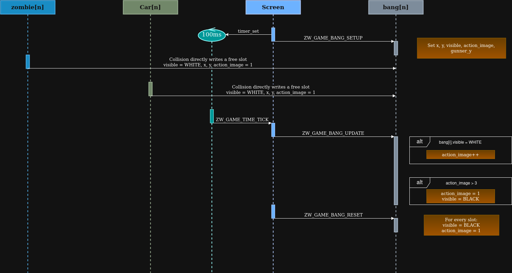
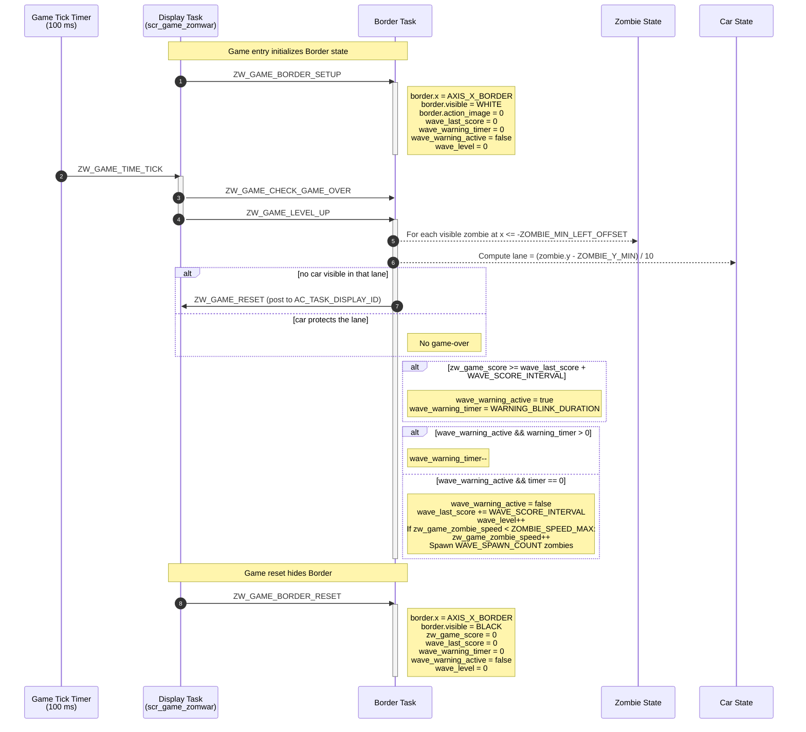
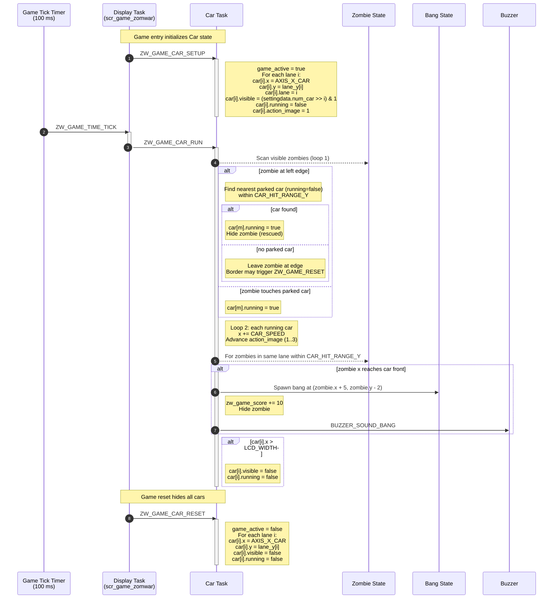
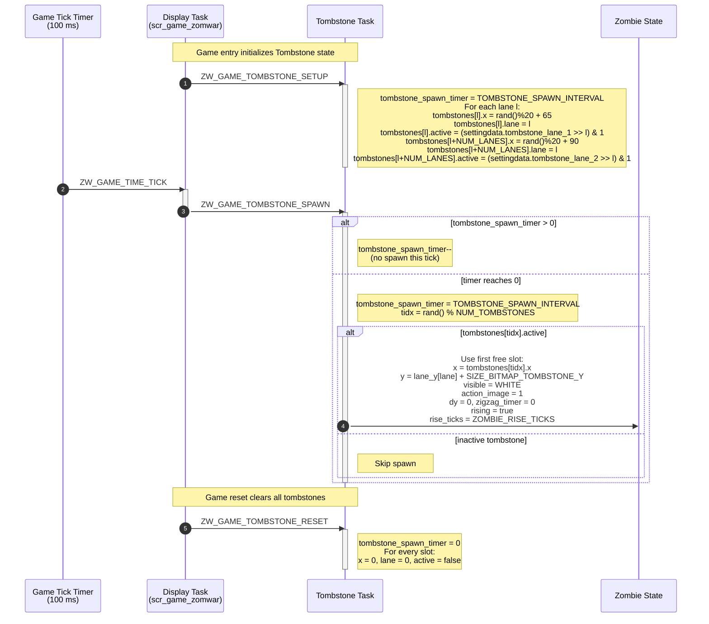

# Game Object Sequences

This document describes the runtime sequence of each main object in Zomwar. Each object is handled by its own AK task and receives signals from the screen task (`scr_game_zomwar`), button callbacks, the periodic game tick timer, or other object tasks.

## I. Object Summary

| Object | Task ID | Handler | Main responsibility |
|---|---|---|---|
| Gunner | `ZW_GAME_GUNNER_ID` | `zw_game_gunner_handle()` | Controls the player position and gunner image state. |
| Bullet | `ZW_GAME_BULLET_ID` | `zw_game_bullet_handle()` | Shoots bullets, moves active bullets, and hides them when they exit the screen. |
| Zombie | `ZW_GAME_ZOMBIE_ID` | `zw_game_zombie_handle()` | Spawns zombies, moves them (zigzag, rising from tombstones), checks collision with bullets, and updates score. |
| Bang | `ZW_GAME_BANG_ID` | `zw_game_bang_handle()` | Plays explosion animation after a zombie is hit. |
| Border | `ZW_GAME_BORDER_ID` | `zw_game_border_handle()` | Checks wave level-up and game-over conditions. |
| Car | `ZW_GAME_CAR_ID` | `zw_game_car_handle()` | Lawnmower-style rescue cars that activate when a zombie reaches the left edge or touches a parked car. |
| Tombstone | `ZW_GAME_TOMBSTONE_ID` | `zw_game_tombstone_handle()` | Spawns extra zombies that rise out of active tombstones. |

The screen task posts `ZW_GAME_TIME_TICK` every `ZW_GAME_TIME_TICK_INTERVAL` (100 ms). On each tick the screen task fans out signals to every object task in a fixed order.

## II. Gunner Object Sequence

Gunner owns the player position. The screen task initializes the Gunner object when gameplay starts, then the periodic game tick translates the latched direction (`gunner_dir`) into `ZW_GAME_GUNNER_UP` / `ZW_GAME_GUNNER_DOWN` and always posts `ZW_GAME_GUNNER_UPDATE`. Button callbacks only update `gunner_dir` inside the screen task; they do not post to the Gunner task directly. Movement changes the internal `gunner_y` value, clamps it, then copies it into the rendered `gunner.y`.

<table align="center">
  <tr>
    <td align="center"></td>
  </tr>
</table>

<strong><em>Figure 1:</em></strong> Gunner sequence logic

## III. Bullet Object Sequence

Bullet receives shoot input from the MODE button (only while `zw_game_state == GAME_PLAY`). The screen task posts `ZW_GAME_BULLET_RUN` on every game tick so visible bullets keep moving to the right. When a bullet exits the screen, it is hidden and its x position is cleared.

<table align="center">
  <tr>
    <td align="center"></td>
  </tr>
</table>

<strong><em>Figure 2:</em></strong> Bullet sequence logic

## IV. Zombie Object Sequence

Zombie moves from right to left with zigzag motion on the Y axis. On each tick, the screen task posts `ZW_GAME_ZOMBIE_RUN` to move visible zombies and advance their animation frame, then posts `ZW_GAME_ZOMBIE_DETONATOR` to check bullet collisions. Zombies that are still `rising` from a tombstone do not move horizontally — they walk up by 1 px per tick for `ZOMBIE_RISE_TICKS` ticks, then join the normal flow. The task also auto-respawns from the right edge to keep at least `NUM_ZOMBIES_INIT` zombies alive at all times.

<table align="center">
  <tr>
    <td align="center"></td>
  </tr>
</table>

<strong><em>Figure 3:</em></strong> Zombie sequence logic

The Zombie task also exposes `ZW_GAME_ZOMBIE_SETUP_MENU` and `ZW_GAME_ZOMBIE_RUN_MENU` signals used by the menu screen to display a single demo zombie that loops across the screen and reacts to bullets without affecting the score.

## V. Bang Object Sequence

Bang is the explosion effect. It is not spawned by a dedicated signal — the Zombie task and Car task directly mutate the `bang[]` array when they detect a collision. On every game tick the screen task posts `ZW_GAME_BANG_UPDATE`; each visible bang advances its animation frame, and when the frame counter rolls past 3 the bang hides itself and resets its frame to 1.

<table align="center">
  <tr>
    <td align="center"></td>
  </tr>
</table>

<strong><em>Figure 4:</em></strong> Zombie sequence logic

## VI. Border Object Sequence

Border manages wave progression and the game-over check. Each game tick the screen task posts both `ZW_GAME_CHECK_GAME_OVER` and `ZW_GAME_LEVEL_UP` to the Border task. If a visible zombie reaches the left edge in a lane that has no visible car, Border posts `ZW_GAME_RESET` to the display task. When `zw_game_score` reaches the next `WAVE_SCORE_INTERVAL` threshold, Border starts a warning blink for `WARNING_BLINK_DURATION` ticks, then increases `zw_game_zombie_speed` (capped at `ZOMBIE_SPEED_MAX`), increments `wave_level`, and spawns `WAVE_SPAWN_COUNT` new zombies.

## VII. Car Object Sequence

Car implements the lawnmower-style rescue. There is one car slot per lane (`NUM_LANES = 5`); whether a slot is initially visible is decided by the `settingdata.num_car` bitmask. On each tick the screen task posts `ZW_GAME_CAR_RUN`. The handler runs two loops in order: first it scans zombies — if any visible zombie has touched the left edge it activates the nearest free parked car in range (`CAR_HIT_RANGE_Y`) and kills that zombie; it also activates a parked car when a zombie walks into its bumper. Then it advances every running car to the right, mowing down zombies in the same lane (creating a Bang, +10 score, `BUZZER_SOUND_BANG`). When a running car leaves the screen its slot becomes invisible and consumed.

## VIII. Tombstone Object Sequence

Tombstone produces extra zombies that rise out of decorative tombstones. `NUM_TOMBSTONES = 10` slots, laid out as `TOMBSTONES_PER_LANE = 2` per lane. Whether each slot is active is decided by the `settingdata.tombstone_lane_1` and `settingdata.tombstone_lane_2` bitmasks. On every tick the screen task posts `ZW_GAME_TOMBSTONE_SPAWN`; the handler decrements a spawn timer and only acts every `TOMBSTONE_SPAWN_INTERVAL` ticks. When it fires, it picks a random tombstone — if active, it inserts a `rising` zombie into the first free zombie slot.

## IX. Per-Tick Signal Order

The screen task `scr_game_zomwar` posts the following sequence on every `ZW_GAME_TIME_TICK`:

1. `ZW_GAME_GUNNER_UP` or `ZW_GAME_GUNNER_DOWN` (depending on `gunner_dir`)
2. `ZW_GAME_GUNNER_UPDATE`
3. `ZW_GAME_BULLET_RUN`
4. `ZW_GAME_ZOMBIE_RUN`
5. `ZW_GAME_ZOMBIE_DETONATOR`
6. `ZW_GAME_TOMBSTONE_SPAWN`
7. `ZW_GAME_CAR_RUN`
8. `ZW_GAME_BANG_UPDATE`
9. `ZW_GAME_CHECK_GAME_OVER`
10. `ZW_GAME_LEVEL_UP`

On `SCREEN_ENTRY` the screen task posts the matching `*_SETUP` signals to all object tasks and starts the periodic `ZW_GAME_TIME_TICK` timer. On `ZW_GAME_RESET` it removes the timer, posts the `*_RESET` signals, saves `gamescore.score_now = zw_game_score`, transitions to `GAME_OVER`, and arms a one-shot `ZW_GAME_EXIT_GAME` timer.

## X. Code References

| Object | Source file | Header file |
|---|---|---|
| Gunner | `application/sources/app/game/game_zomwar/zw_game_gunner.cpp` | `application/sources/app/game/game_zomwar/zw_game_gunner.h` |
| Bullet | `application/sources/app/game/game_zomwar/zw_game_bullet.cpp` | `application/sources/app/game/game_zomwar/zw_game_bullet.h` |
| Zombie | `application/sources/app/game/game_zomwar/zw_game_zombie.cpp` | `application/sources/app/game/game_zomwar/zw_game_zombie.h` |
| Bang | `application/sources/app/game/game_zomwar/zw_game_bang.cpp` | `application/sources/app/game/game_zomwar/zw_game_bang.h` |
| Border | `application/sources/app/game/game_zomwar/zw_game_border.cpp` | `application/sources/app/game/game_zomwar/zw_game_border.h` |
| Car | `application/sources/app/game/game_zomwar/zw_game_car.cpp` | `application/sources/app/game/game_zomwar/zw_game_car.h` |
| Tombstone | `application/sources/app/game/game_zomwar/zw_game_tombstone.cpp` | `application/sources/app/game/game_zomwar/zw_game_tombstone.h` |
| Screen | `application/sources/app/screens/scr_game_zomwar.cpp` | `application/sources/app/screens/scr_game_zomwar.h` |
