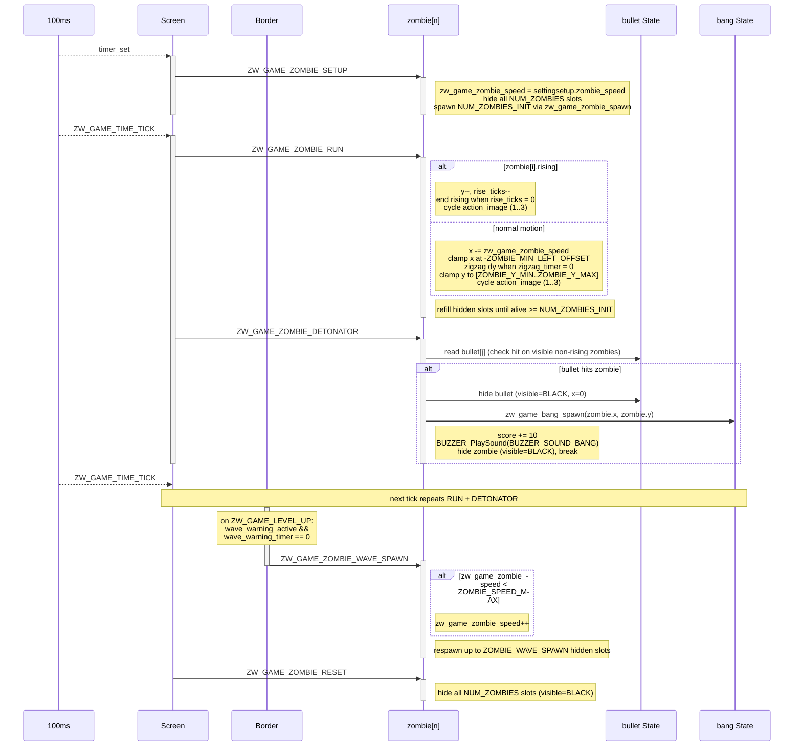

# Game Object Sequences

This document describes the runtime sequence of each main object in Zomwar. Each object is handled by its own AK task and receives signals from the screen task (`scr_game_zomwar`), button callbacks, the periodic game tick timer, or other object tasks.

## I. Object Summary

| Object | Task ID | Handler | Main responsibility |
|---|---|---|---|
| Gunner | `ZW_GAME_GUNNER_ID` | `zw_game_gunner_handle()` | Controls the player position and gunner image state. |
| Bullet | `ZW_GAME_BULLET_ID` | `zw_game_bullet_handle()` | Shoots bullets, moves active bullets, and hides them when they exit the screen. |
| Zombie | `ZW_GAME_ZOMBIE_ID` | `zw_game_zombie_handle()` | Spawns zombies, moves them (zigzag, rising from tombstones), checks collision with bullets, and updates score. |
| Bang | `ZW_GAME_BANG_ID` | `zw_game_bang_handle()` | Plays explosion animation after a zombie is hit. |
| Border | `ZW_GAME_BORDER_ID` | `zw_game_border_handle()` | Checks wave level-up and game-over conditions. |
| Car | `ZW_GAME_CAR_ID` | `zw_game_car_handle()` | Lawnmower-style rescue cars that activate when a zombie reaches the left edge or touches a parked car. |
| Tombstone | `ZW_GAME_TOMBSTONE_ID` | `zw_game_tombstone_handle()` | Spawns extra zombies that rise out of active tombstones. |

The screen task posts `ZW_GAME_TIME_TICK` every `ZW_GAME_TIME_TICK_INTERVAL` (100 ms). On each tick the screen task fans out signals to every object task in a fixed order.

## II. Gunner Object Sequence

Gunner owns the player position. The screen task initializes the Gunner object when gameplay starts, then the periodic game tick translates the latched direction (`gunner_dir`) into `ZW_GAME_GUNNER_UP` / `ZW_GAME_GUNNER_DOWN` and always posts `ZW_GAME_GUNNER_UPDATE`. Button callbacks only update `gunner_dir` inside the screen task; they do not post to the Gunner task directly. Movement changes the internal `gunner_y` value, clamps it (`AXIS_Y_GUNNER_MIN`..`AXIS_Y_GUNNER_MAX`), then copies it into the rendered `gunner.y`. `ZW_GAME_GUNNER_UPDATE` also clears the recoil frame by resetting `gunner.action_image` from `2` back to `1` (the recoil frame is raised by the Bullet task on `ZW_GAME_BULLET_SHOOT`).

<table align="center">
  <tr>
    <td align="center"></td>
  </tr>
</table>

<strong><em>Figure 1:</em></strong> Gunner sequence logic

## III. Bullet Object Sequence

Bullet receives shoot input from the MODE button (only while `zw_game_state == GAME_PLAY`). `ZW_GAME_BULLET_SHOOT` picks the first free slot in `bullet[]`, spawns it at `(gunner.x + 15, gunner.y - 8)`, sets `gunner.action_image = 2` to show the recoil frame, and plays `BUZZER_SOUND_CLICK`. The screen task posts `ZW_GAME_BULLET_RUN` on every game tick so visible bullets keep moving to the right by `STEP_BULLET_AXIS_X`. When a bullet reaches `MAX_AXIS_X_BULLET`, it is hidden and its x position is cleared.

<table align="center">
  <tr>
    <td align="center"></td>
  </tr>
</table>

<strong><em>Figure 2:</em></strong> Bullet sequence logic

## IV. Zombie Object Sequence

Zombie owns the horde state. On `ZW_GAME_ZOMBIE_SETUP` it reads `zw_game_zombie_speed` from `settingsetup.zombie_speed`, hides every slot in `zombie[]`, then spawns the first `NUM_ZOMBIES_INIT` zombies at random `(x, y)` inside the right margin (x in `130..168`, y in `ZOMBIE_Y_MIN..ZOMBIE_Y_MAX`). On every `ZW_GAME_TIME_TICK` the screen task posts `ZW_GAME_ZOMBIE_RUN` followed by `ZW_GAME_ZOMBIE_DETONATOR`. In `RUN`, each visible zombie either rises one pixel up (when it was spawned from a tombstone via `zw_game_zombie_spawn_rise()` and `rise_ticks > 0`; when `rise_ticks` reaches zero, `rising` is cleared and `zigzag_timer` is re-rolled), or steps left by `zw_game_zombie_speed` (clamped at `-ZOMBIE_MIN_LEFT_OFFSET`), applies a vertical zigzag (`dy` re-rolled to `-1..+1` every `zigzag_timer` ticks, clamped to `ZOMBIE_Y_MIN..ZOMBIE_Y_MAX` and reset to `0` on clamp), and cycles `action_image` through frames `1→2→3`. After moving, the task tops the alive count back up to `NUM_ZOMBIES_INIT` by re-spawning hidden slots. In `DETONATOR`, for every visible non-rising zombie it walks `bullet[]`, calls `zw_game_zombie_check_hit()`, and on a hit hides the bullet (`visible = BLACK`, `x = 0`), calls `zw_game_bang_spawn()`, adds `10` to `zw_game_score`, plays `BUZZER_SOUND_BANG`, and hides the zombie. `ZW_GAME_ZOMBIE_WAVE_SPAWN` (posted from the Border task on level-up) increments `zw_game_zombie_speed` up to `ZOMBIE_SPEED_MAX` and respawns up to `ZOMBIE_WAVE_SPAWN` hidden slots. `ZW_GAME_ZOMBIE_RESET` hides every slot.

<strong><em>Figure 3:</em></strong> Zombie sequence logic

## IX. Per-Tick Signal Order

The screen task `scr_game_zomwar` posts the following sequence on every `ZW_GAME_TIME_TICK`:

1. `ZW_GAME_GUNNER_UP` or `ZW_GAME_GUNNER_DOWN` (depending on `gunner_dir`)
2. `ZW_GAME_GUNNER_UPDATE`
3. `ZW_GAME_BULLET_RUN`
4. `ZW_GAME_ZOMBIE_RUN`
5. `ZW_GAME_ZOMBIE_DETONATOR`
6. `ZW_GAME_TOMBSTONE_SPAWN`
7. `ZW_GAME_CAR_RUN`
8. `ZW_GAME_CAR_HIT`
9. `ZW_GAME_BANG_UPDATE`
10. `ZW_GAME_CHECK_GAME_OVER`
11. `ZW_GAME_WAVE_CHECK`
12. `ZW_GAME_LEVEL_UP`

On `SCREEN_ENTRY` the screen task posts the matching `*_SETUP` signals to all object tasks and starts the periodic `ZW_GAME_TIME_TICK` timer. On `ZW_GAME_RESET` it removes the timer, posts the `*_RESET` signals, saves `gamescore.score_now = zw_game_score`, transitions to `GAME_OVER`, and arms a one-shot `ZW_GAME_EXIT_GAME` timer.

## X. Code References

| Object | Source file | Header file |
|---|---|---|
| Gunner | `application/sources/app/game/game_zomwar/zw_game_gunner.cpp` | `application/sources/app/game/game_zomwar/zw_game_gunner.h` |
| Bullet | `application/sources/app/game/game_zomwar/zw_game_bullet.cpp` | `application/sources/app/game/game_zomwar/zw_game_bullet.h` |
| Zombie | `application/sources/app/game/game_zomwar/zw_game_zombie.cpp` | `application/sources/app/game/game_zomwar/zw_game_zombie.h` |
| Bang | `application/sources/app/game/game_zomwar/zw_game_bang.cpp` | `application/sources/app/game/game_zomwar/zw_game_bang.h` |
| Border | `application/sources/app/game/game_zomwar/zw_game_border.cpp` | `application/sources/app/game/game_zomwar/zw_game_border.h` |
| Car | `application/sources/app/game/game_zomwar/zw_game_car.cpp` | `application/sources/app/game/game_zomwar/zw_game_car.h` |
| Tombstone | `application/sources/app/game/game_zomwar/zw_game_tombstone.cpp` | `application/sources/app/game/game_zomwar/zw_game_tombstone.h` |
| Screen | `application/sources/app/screens/scr_game_zomwar.cpp` | `application/sources/app/screens/scr_game_zomwar.h` |
