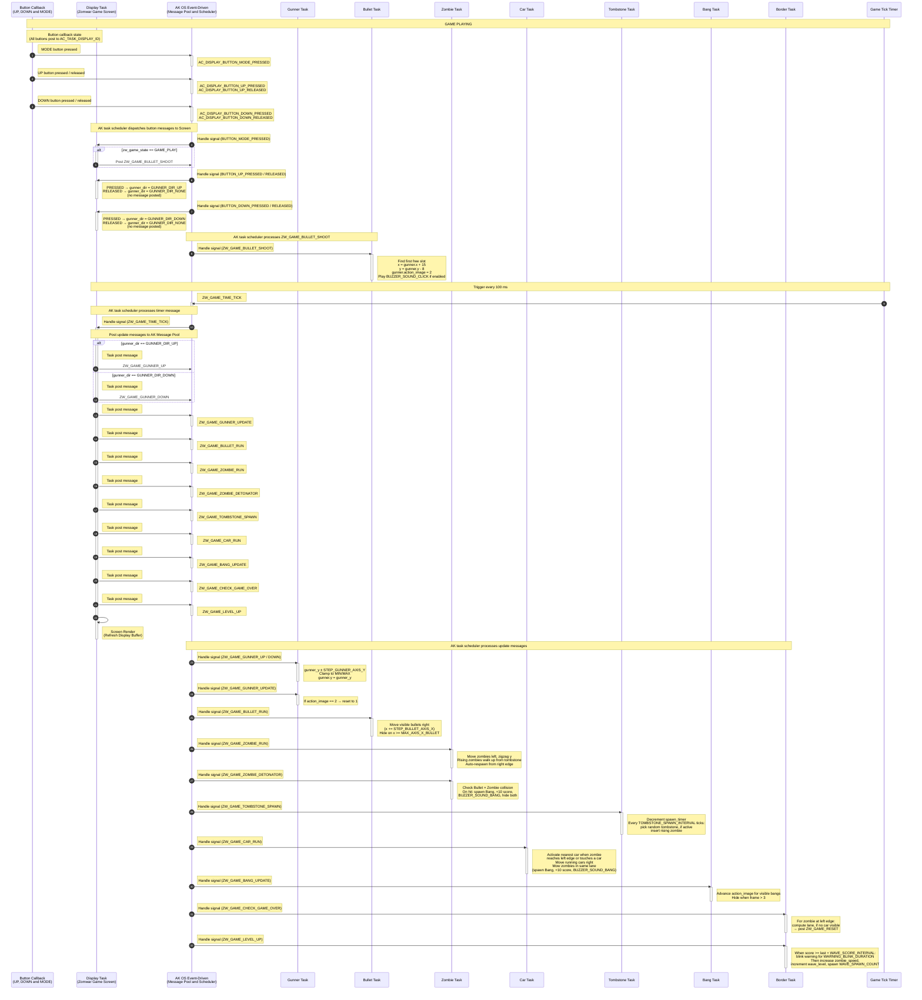
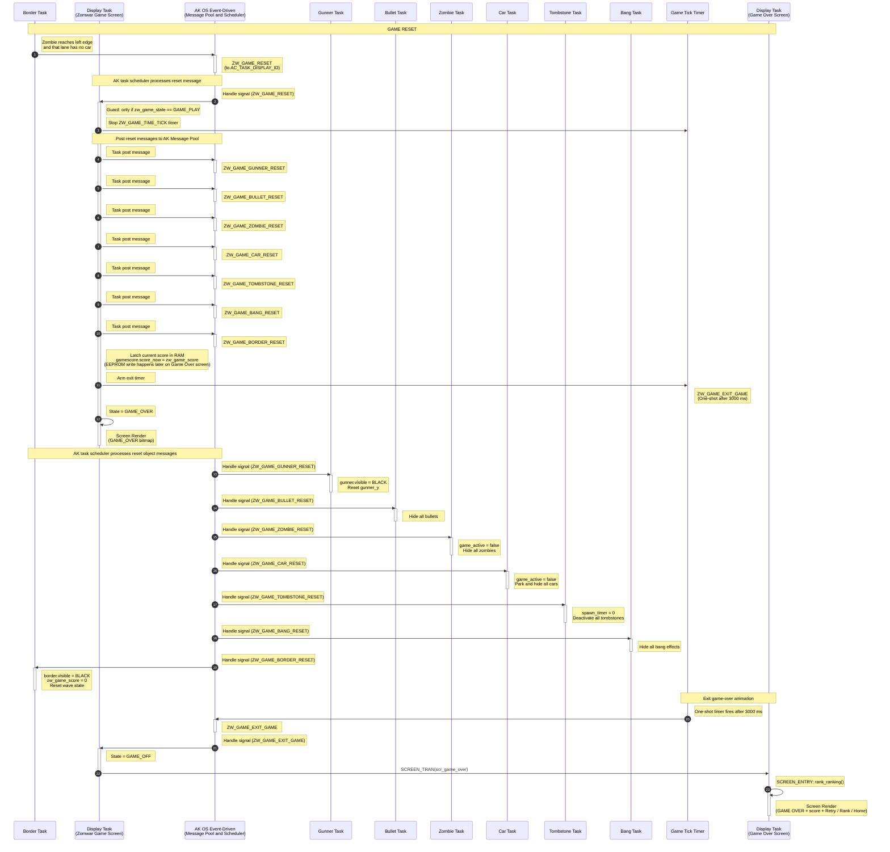

# Runtime Signal Processing

This document explains how the Zomwar Game processes button input, task messages, game-loop ticks, and object updates. The game uses the AK event-driven task architecture: each major game object owns a task, receives signals through AK messages, and updates its own state.

## I. Overview

The Zomwar Game is implemented using event-driven tasks.

Each game object owns:

- A dedicated task
- Its own signal handler
- Its own state data
- Its own update logic

The display task (`AC_TASK_DISPLAY_ID`) owns the screen manager and handles screen-level events. During gameplay the active screen `scr_game_zomwar` receives the periodic game tick and posts update messages for each game-object task.

Input events from hardware buttons are converted into software signals. Button callbacks always post `AC_DISPLAY_BUTTON_*` signals to `AC_TASK_DISPLAY_ID`; the active screen handler decides what to do with them. During gameplay the screen translates UP/DOWN into a latched `gunner_dir` and translates MODE_PRESSED into `ZW_GAME_BULLET_SHOOT`.

The main game loop is driven by a periodic timer signal:

```c
ZW_GAME_TIME_TICK
```

The current game tick interval is:

```c
ZW_GAME_TIME_TICK_INTERVAL = 100 ms
```

Main runtime flow:

1. Button callbacks or timers create software signals.
2. Signals are posted into the AK message pool.
3. The AK scheduler dispatches messages to destination task handlers.
4. Each task updates only the state it owns.
5. The screen render reads the latest object state and refreshes the display buffer.

### High Level Architecture

#### 1. Game Start


<table align="center">
  <tr>
    <td align="center"></td>
  </tr>
</table>
<p align="center"><strong><em>Figure 1:</em></strong> Game start sequence logic</p>

#### 2. Game Playing



#### 3. Game Reset



## II. Code References

| Area | File |
|---|---|
| Task IDs and task handlers | `application/sources/app/task_list.h` |
| Task table registration | `application/sources/app/task_list.cpp` |
| Signal definitions | `application/sources/app/app.h` |
| Button callback logic | `application/sources/app/app_bsp.cpp` |
| Main game screen logic | `application/sources/app/screens/scr_game_zomwar.cpp` |
| Game-over screen logic | `application/sources/app/screens/scr_game_over.cpp` |
| Screen manager | `application/sources/common/screen_manager.cpp` |

## III. Task Ownership

| Task | Responsibility | Owns Data | Receives Signals |
|---|---|---|---|
| `AC_TASK_DISPLAY_ID` | Screen manager, render scheduling, button routing, central game-tick dispatch | Current screen state, `zw_game_state`, `gunner_dir`, `gamescore` | All `AC_DISPLAY_*` button signals, `ZW_GAME_TIME_TICK`, `ZW_GAME_RESET`, `ZW_GAME_EXIT_GAME` |
| `ZW_GAME_GUNNER_ID` | Player control | Gunner position and display state | `SETUP`, `UPDATE`, `UP`, `DOWN`, `RESET` |
| `ZW_GAME_BULLET_ID` | Bullet movement and shooting | All bullet slots | `SETUP`, `RUN`, `SHOOT`, `RESET` |
| `ZW_GAME_ZOMBIE_ID` | Zombie movement, collision, score, menu demo | Zombie slots, `zw_game_zombie_speed` | `SETUP`, `RUN`, `DETONATOR`, `RESET`, `SETUP_MENU`, `RUN_MENU` |
| `ZW_GAME_CAR_ID` | Lawnmower rescue logic | Per-lane car slots | `SETUP`, `RUN`, `RESET` |
| `ZW_GAME_TOMBSTONE_ID` | Tombstone spawn timing | Tombstone slots, spawn timer | `SETUP`, `SPAWN`, `RESET` |
| `ZW_GAME_BANG_ID` | Explosion animation | Bang slots | `SETUP`, `UPDATE`, `RESET` |
| `ZW_GAME_BORDER_ID` | Wave / level-up / game-over detection | `border`, `zw_game_score`, wave state | `SETUP`, `LEVEL_UP`, `CHECK_GAME_OVER`, `RESET` |

## IV. Button Event Processing

In Zomwar, button callbacks always post `AC_DISPLAY_BUTTON_*` signals to `AC_TASK_DISPLAY_ID`. The currently active screen handler then decides what to do with them. The Zomwar gameplay screen (`scr_game_zomwar`) handles those signals locally; it does not require the BSP to know which screen is active.

### Button Processing Rules

| Button | BSP posts to AK | Active screen | Result inside the screen handler |
|---|---|---|---|
| MODE Pressed | `AC_DISPLAY_BUTTON_MODE_PRESSED` → `AC_TASK_DISPLAY_ID` | `scr_game_zomwar` | If `zw_game_state == GAME_PLAY`: post `ZW_GAME_BULLET_SHOOT` to `ZW_GAME_BULLET_ID` |
| UP Pressed | `AC_DISPLAY_BUTTON_UP_PRESSED` → `AC_TASK_DISPLAY_ID` | `scr_game_zomwar` | `gunner_dir = GUNNER_DIR_UP` (no message posted) |
| UP Released | `AC_DISPLAY_BUTTON_UP_RELEASED` → `AC_TASK_DISPLAY_ID` | `scr_game_zomwar` | If `gunner_dir == GUNNER_DIR_UP`: `gunner_dir = GUNNER_DIR_NONE` |
| DOWN Pressed | `AC_DISPLAY_BUTTON_DOWN_PRESSED` → `AC_TASK_DISPLAY_ID` | `scr_game_zomwar` | `gunner_dir = GUNNER_DIR_DOWN` (no message posted) |
| DOWN Released | `AC_DISPLAY_BUTTON_DOWN_RELEASED` → `AC_TASK_DISPLAY_ID` | `scr_game_zomwar` | If `gunner_dir == GUNNER_DIR_DOWN`: `gunner_dir = GUNNER_DIR_NONE` |

Note: the BSP's MODE callback only posts on `BUTTON_SW_STATE_PRESSED`; there is no `MODE_RELEASED` event. The actual `ZW_GAME_GUNNER_UP`/`DOWN` signals are posted by the screen on every `ZW_GAME_TIME_TICK` based on the latched `gunner_dir`, not by the button callback directly.

## V. Runtime Scheduling Notes

The system uses asynchronous task-based scheduling.

Important runtime characteristics:

- Signals are queued in AK before they are handled.
- A sender posts a message; it does not directly execute the destination task handler.
- Handlers are isolated by task ownership.
- Game logic is decoupled through signals.
- Timing depends on scheduler execution order.
- A signal may wait in the AK message pool before its handler executes.
- `ZW_GAME_TIME_TICK` can appear between button pressed and released logs because the timer keeps running.
- The Bang and the Car tasks may also be triggered indirectly: Zombie and Car write to `bang[]` directly when a collision is detected, without posting a separate spawn signal.
- The game-over flow is split between two screens: `scr_game_zomwar` latches `gamescore.score_now` and arms a one-shot `ZW_GAME_EXIT_GAME` timer; `scr_game_over` runs the ranking and writes the score to EEPROM only after the user presses Retry / Rank / Home.
