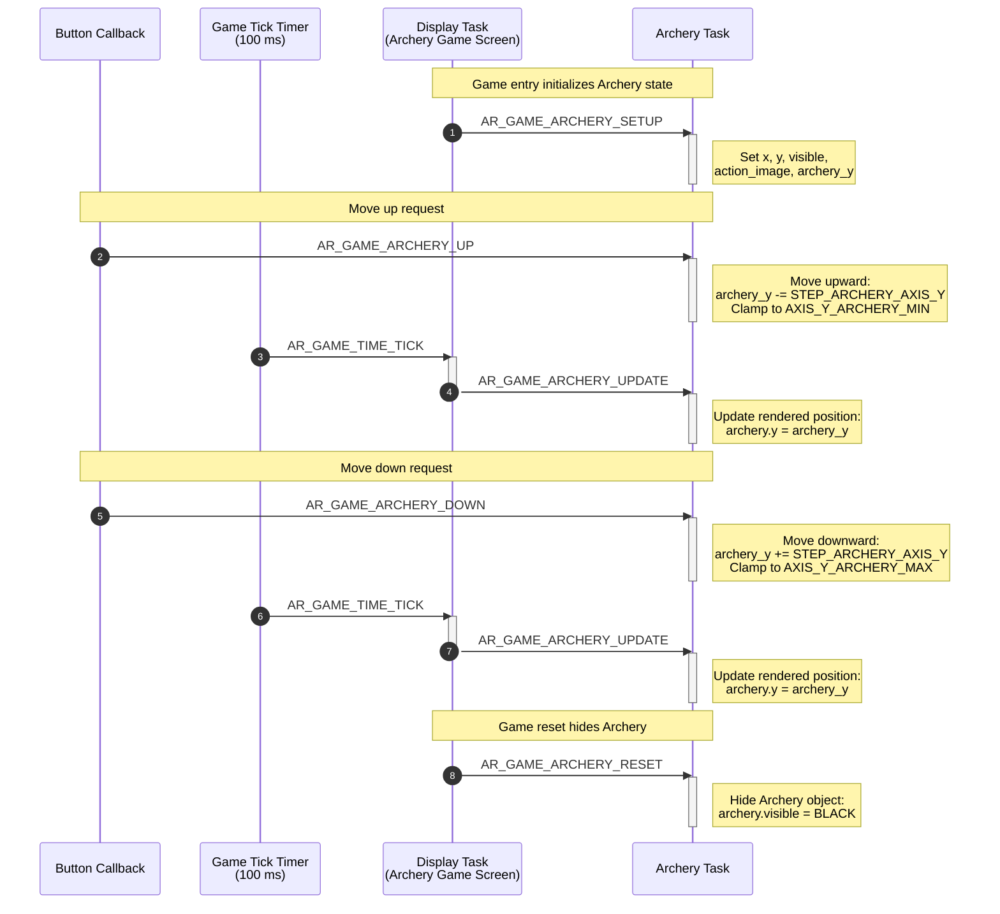
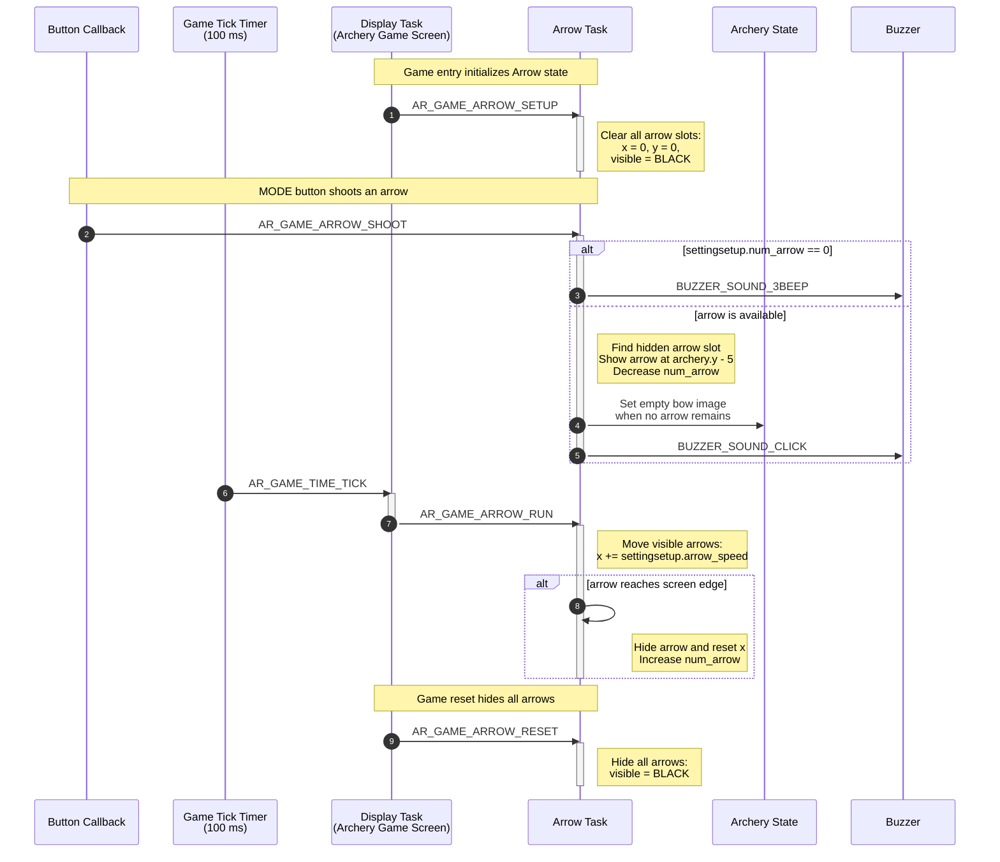
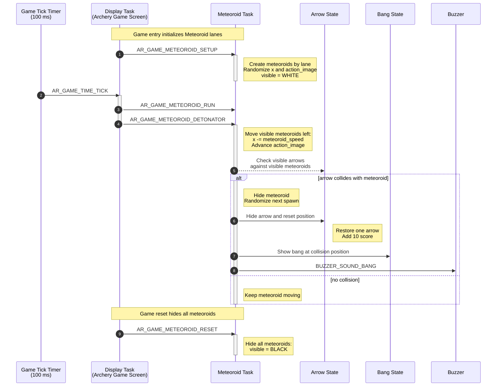
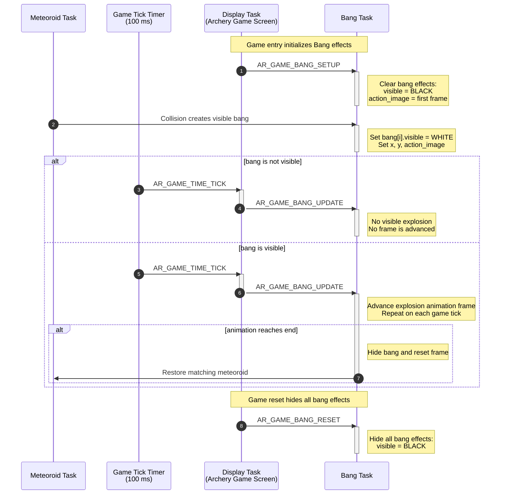
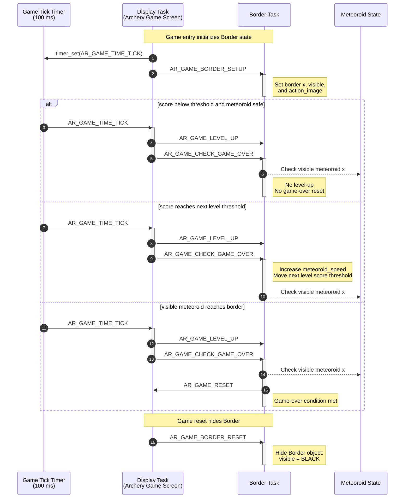

# Game Object Sequences

This document describes the runtime sequence of each main object in Zomwar. Each object is handled by its own AK task and receives signals from the screen task, button callbacks, timers, or other object tasks.

## I. Object Summary

| Object | Task ID | Handler | Main responsibility |
|---|---|---|---|
| Archery | `AR_GAME_ARCHERY_ID` | `ar_game_archery_handle()` | Controls the player position and bow image state. |
| Arrow | `AR_GAME_ARROW_ID` | `ar_game_arrow_handle()` | Shoots arrows, moves active arrows, and restores available arrow count. |
| Meteoroid | `AR_GAME_METEOROID_ID` | `ar_game_meteoroid_handle()` | Spawns meteoroids, moves them, checks collision with arrows, and updates score. |
| Bang | `AR_GAME_BANG_ID` | `ar_game_bang_handle()` | Plays explosion animation after a meteoroid is hit. |
| Border | `AR_GAME_BORDER_ID` | `ar_game_border_handle()` | Checks level-up condition and game-over condition. |

## II. Archery Object Sequence

Archery owns the player position. The screen task initializes the Archery object when gameplay starts, then the periodic game tick posts update messages every `AR_GAME_TIME_TICK_INTERVAL`. Button callbacks post movement signals directly to the Archery task while the game is playing. Movement changes the internal `archery_y` value, and the next update copies that value into the rendered `archery.y`.

## III. Arrow Object Sequence

Arrow receives shoot input from the MODE button. The screen task posts `AR_GAME_ARROW_RUN` on every game tick so visible arrows keep moving to the right. When an arrow exits the screen, it is hidden, reset, and the available arrow count is restored.

**Note:** *Because a slow arrow speed would significantly affect the gameplay experience, the arrow speed setting has been locked.*

## IV. Meteoroid Object Sequence

Meteoroid moves from right to left. On each tick, the screen task first posts `AR_GAME_METEOROID_RUN` to move visible meteoroids and advance their animation frame, then posts `AR_GAME_METEOROID_DETONATOR` to check arrow collisions.

## V. Bang Object Sequence

Bang is the explosion effect. It becomes visible when Meteoroid detects a collision. On every game tick, the screen task posts `AR_GAME_BANG_UPDATE`; visible bang effects advance their animation frame, then hide themselves and restore the matching meteoroid when the animation ends.

## VI. Border Object Sequence

Border protects the safe area. Each game tick asks Border to check level-up progress and game-over conditions. If the score reaches the next threshold, Border increases meteoroid speed. If a visible meteoroid reaches the border, Border posts `AR_GAME_RESET` back to the screen task.

## VII. Code References

| Object | Source file | Header file |
|---|---|---|
| Archery | `application/sources/app/game/archery_game/ar_game_archery.cpp` | `application/sources/app/game/archery_game/ar_game_archery.h` |
| Arrow | `application/sources/app/game/archery_game/ar_game_arrow.cpp` | `application/sources/app/game/archery_game/ar_game_arrow.h` |
| Meteoroid | `application/sources/app/game/archery_game/ar_game_meteoroid.cpp` | `application/sources/app/game/archery_game/ar_game_meteoroid.h` |
| Bang | `application/sources/app/game/archery_game/ar_game_bang.cpp` | `application/sources/app/game/archery_game/ar_game_bang.h` |
| Border | `application/sources/app/game/archery_game/ar_game_border.cpp` | `application/sources/app/game/archery_game/ar_game_border.h` |
